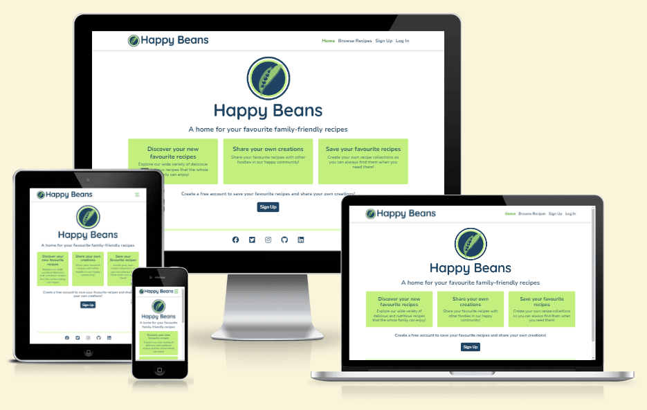
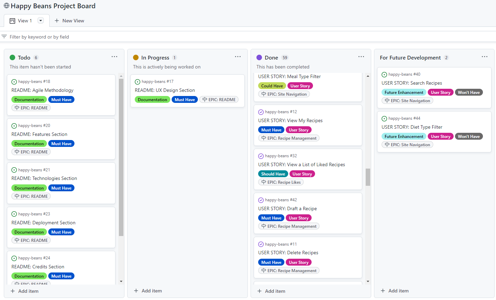
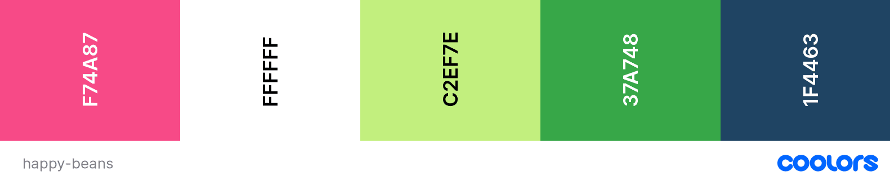
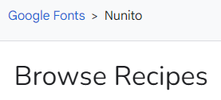

# Happy Beans

## Introduction

Happy Beans is a Full-Stack web application built with Django. 
It is a recipe-sharing website, where users can view and share family-friendly recipes. 
Registered users have the ability to post recipes, like recipes to save them in their own recipe collections, and post comments to interact with the community. 
The intended audience is anyone who enjoys cooking tasty and nutritious meals for the whole family.

The application implements user authentication to provide role-based access to its centrally-owned dataset,
and user authorisation to allow users to manipulate their own data records.
It includes full CRUD functionality for recipes and comments, allowing users to create, read, update and delete their recipes and comments.

The application also provides an admin dashboard where the admin role has full CRUD functionality for all recipes, comments and users so that they can manage the contents of the website. 

Click here to view [Happy Beans](https://happy-beans.herokuapp.com/) (CTRL + Click to open in a new browser tab).

## UXD - User Experience Design

### User Stories
Based on the concept of a recipe-sharing website, the following 6 Epics were created for the application's features. 
These epics were then further developed into 28 User Stories.

#### EPIC: User Account
* As a Site User, I can register an account so that I can access all the application's features.
* As a Site User, I can log into my account so that all the application's features are available to me.
* As a Site User, I can log out of my account so that I can keep my account secure.

#### EPIC: Site Admin
* As a Site Admin, I can create, update and delete recipes and comments so that I can manage the contents of my app.

#### EPIC: Site Navigation
* As a Site User, I can understand the purpose of the app clearly so that I can decide whether the contents are right for me to sign up.
* As a Site User, I can navigate the site intuitively so that I can easily find what I am looking for.
* As a Site User, I can browse a paginated list of recipes so that I can easily select a recipe to view.
* As a Site User, I can select a recipe from the list so that I can view the full details of a recipe.
* As a Site User, I can view the comments posted by others so that I can see the feedback and conversation for each recipe.
* As a Site User, I can filter the recipes by meal type so that I can view a list of recipes for the meal type.
* As a Site User, I can filter the recipes by main ingredient so that I can view a list of recipes using the main ingredient.
* As a Site User, I can filter the recipes based on difficulty so that I can view a list of recipes suitable for my level.
* As a Site User, I can see a custom error message when an HTTP error occurs so that I can understand why the error has occurred and easily navigate back to the website.

#### EPIC: Recipe Management
* As a Site User, I can post my own recipe so that I can share it with others.
* As a Site User, I can draft a recipe and save it so that I can return later and edit it.
* As a Site User, I can edit the recipes that I posted so that I can make changes after it has been submitted.
* As a Site User, I can delete recipes that I posted so that I can remove them from the site.
* As a Site User, I can view a list of recipes that I have posted or drafted so that I can manage them.
* As a Site User, I can see error messages when submitting a recipe form so that I understand how the errors can be resolved.

#### EPIC: Recipe Comments
* As a Site User, I can comment on a recipe so that I can share my feedback and be involved in the conversation.
* As a Site User, I can edit the comment I posted so that I can make changes to my comments.
* As a Site User, I can delete the comment I posted so that I can remove it from the comments section.

#### EPIC: Recipe Likes
* As a Site User, I can view the number of likes for each recipe so that I can see the feedback from others.
* As a Site User, I can view the list of my liked recipes so that I can easily go back to them within the site.
* As a Site User, I can like a recipe so that I can interact with the content.
* As a Site User, I can unlike a recipe so that I can remove it from my liked recipes.

The following User Stories were not implemented for EPIC: Site Navigation:

* As a Site User, I can filter the recipes by diet type so that I can view a list of recipes for the diet type.
	Upon review, this was deemed not feasible with standard Django filters as the diet_type is an ArrayField.
* As a Site User, I can search for a recipe based on a particular word or phrase so that I can quickly find what I am looking for.
	Reviewed this issue with a tutor, however, a solution was not found within the time frame given.
	The decision was made to maintain the Django filters and remove the search bar.

### Agile Methodology
This application was developed using agile methodology. 
[Happy Beans Kanban Board](https://github.com/users/ShizukaDonaghue/projects/11) was created using GitHub Projects and was used to manage the entire development process.

 
The 6 Epics listed for the application's features above were included as Milestones in the Kanban board.
A GitHub issue was created for each User Story using my own User Story templates. 
Each User Story contained detailed acceptance criteria and they were broken down into tasks necessary to satisfy those acceptance criteria. 

MoSCoW Prioritisation technique was applied to each User Story and each User Story was labelled based on their prioritisation level as follows:
* Must Have - Guaranteed to be delivered
* Should Have - Add significant value but not vital
* Could Have - Have a small impact if left out
* Won't Have - Not a priority for this iteration

All the User Stories were prioritised based on their prioritisation levels and tracked through the Kanban board until they were executed fully.

The Kanban board also contained 5 other Epics, which were not related to the application's features. 
These were included so that the entire project was tracked and managed through the Kanban board. 
* EPIC: Project Setup
* EPIC: Deployment
* EPIC: Styling
* EPIC: Testing
* EPIC: README

### Wireframes
XXXXXXXXXXXXXXXXXXXXXXXXXXXXXXX ADD SCREENSHOTS HERE XXXXXXXXXXXXXXXXXXXXXXXXXXXXXXXXX

### Application Flow
XXXXXXXXXXXXXXXXXXXXXXXXXXXXXXX ADD SCREENSHOTS HERE XXXXXXXXXXXXXXXXXXXXXXXXXXXXXXXXX

### Database Design
An Entity Relationship Diagram was created using [Figma](https://www.figma.com/) to visualise the relationships between the data structures. 
The intention was to utilise Django-AllAuth for the user authentication system and create two custom models - one for Recipe and the other for Comment.

The Recipe model has a relationship with the User model linked by a Foreign key, which allows the user to be assigned as the author of a recipe. 
It also has ManyToMany relationship for the Likes field so that recipe likes are linked to the user. 
The Comment model is linked to the Recipe model by a Foreign key to store comments for the specific recipe.

### Security Features and Defensive Design
#### User Authentication
Django-AllAuth is used to authenticate users. 
Certain pages within the application can only be accessed by logged-in users. 
These pages are secured with Django's LoginRequiredMixin, which provides role-based access to the central dataset within the application.
If a user tries to access these pages without having logged in, they are directed to Log In page instead.

#### User Authorisation
Users can only edit or delete their own recipes and comments in the application.
Django's UserPassesTestMixin is used to limit access to logged-in users that pass the author test - 
it is used to test if the user is the author of the recipe or comment before it gives permission to edit or delete the object.
If a user tries to edit or delete another user's recipe or comment, HTTP 403 Forbidden error is displayed and prevents the user from editing or deleting the object.

#### Form Validation
Django's built-in form validation is used to validate the forms within the application. 
The forms will not submit unless they are completed correctly.
If there are errors, error messages are displayed to assist users to fill in all the fields correctly.

In addition to Django's built-in form validation, [jQuery Validation Plugin](https://jqueryvalidation.org/) has been added to Post Recipe form.
This displays a custom error message explaining the error for each field to assist users to fill in the field correctly.

Summernote fields are used in the Post Recipe form. 
Since Django's build-in form validation does not catch empty strings in the Summernote fields,
additional form validation measure was added in validators.py to strip white space and raise an error message if the field is left empty.
With these measures combined, the Post Recipe form is fully validated for each submission.

#### Security-Sensitive Information
Environment variables are stored in env.py for local development to ensure security-sensitive information is not pushed to the GitHub repository.
For the production environment, these variables are added to Config Vars for the application in Heroku. 

### Design
#### Colour Scheme
The design of the website is intended to be simple and clean so as not to distract users from colourful images of recipes.
[Coolors](https://coolors.co) was used to create the colour pallet.

* #FFFFFF White is used for the background colour
* #1F4463 Indigo Dye is used for the main text colour to ensure a good contrast against the background colour.
* #C2EF7E Mindaro is used as the background colour for containers in Home, Sign Up and Log In pages. 
* #37A748 Pigment Green is used for the active link in the navigation bar and also for the hover effect on buttons.
* #F74A87 French Rose is used for the Like button on Recipe Detail page.

The logo for the website was created using the same colour palette to be consistent. 

#### Typography
The font used throughout the website is Nunito which is imported from [Google Fonts](https://fonts.google.com/).
It has a happy and playful feel and is easy to read.   
Sans-serif is the backup font in case the main font is not available.

