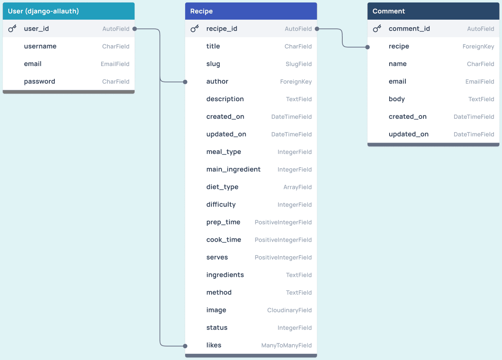
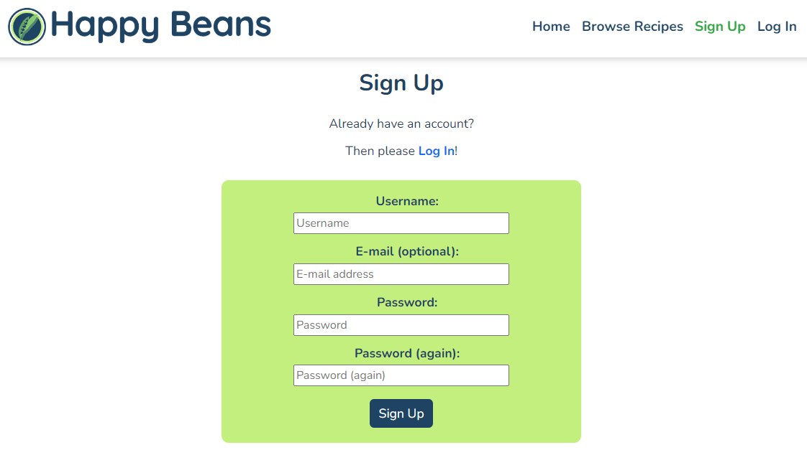
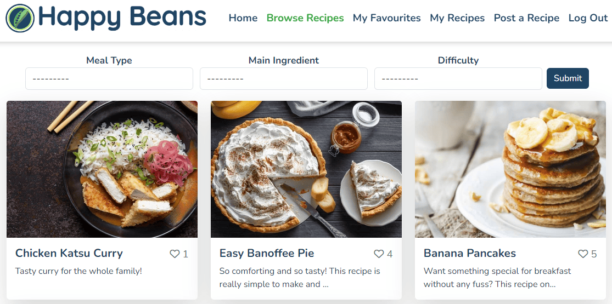
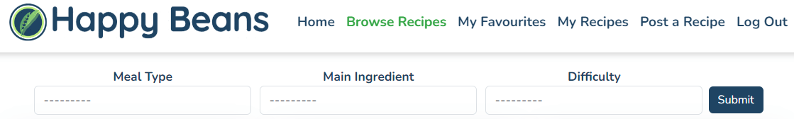
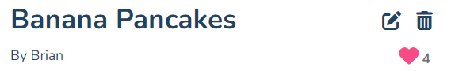
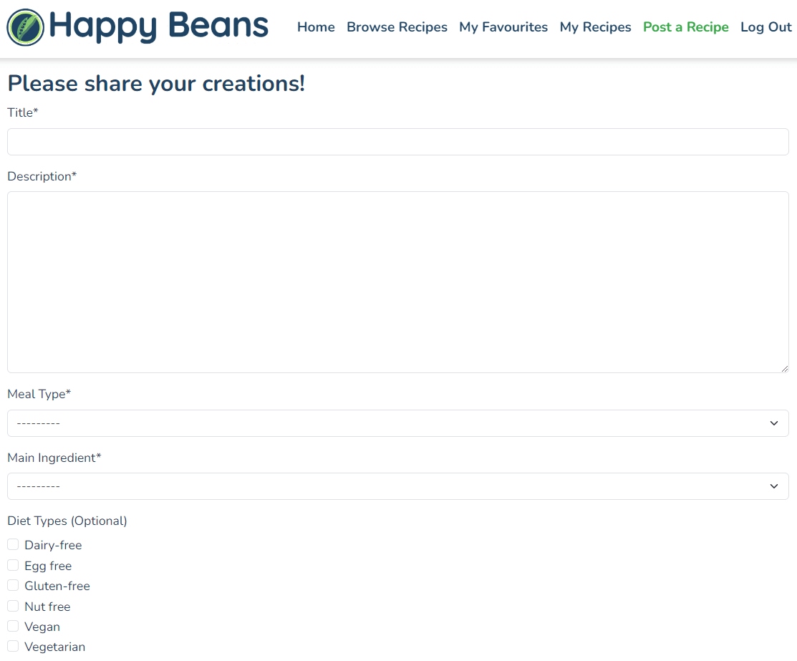
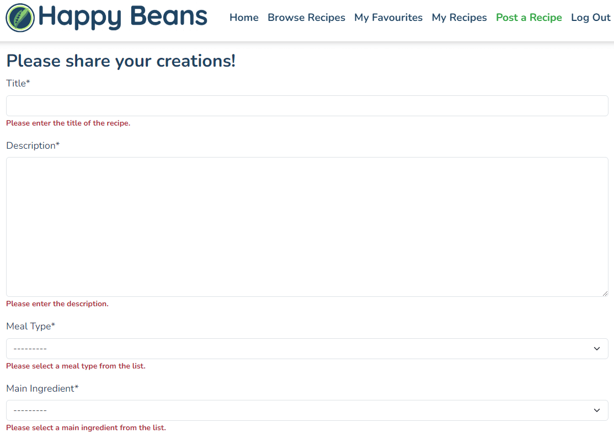
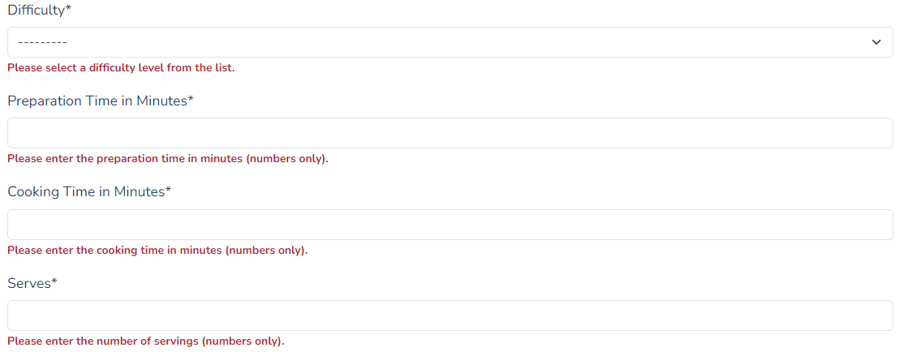
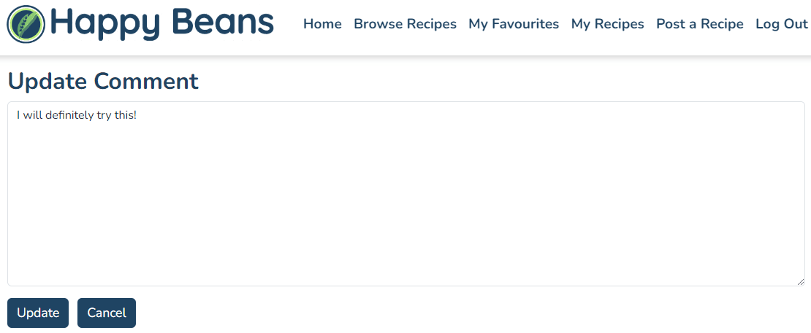

# Happy Beans

Happy Beans is a Full-Stack web application built with Django. 
It is a recipe-sharing website, where users can view and share family-friendly recipes. 
Registered users have the ability to post recipes, like recipes to save them in their own recipe collections, and post comments to interact with the community. 
The intended audience is anyone who enjoys cooking tasty and nutritious meals for the whole family.

The application implements user authentication to provide role-based access to its centrally-owned dataset,
and user authorisation to allow users to manipulate their own data records.
It includes full CRUD functionality for recipes and comments, allowing users to create, read, update and delete their recipes and comments.

The application also provides an admin dashboard where the admin role has full CRUD functionality for all recipes, comments and users so that they can manage the contents of the website. 

Click here to view [Happy Beans](https://happy-beans.herokuapp.com/) (CTRL + Click to open in a new browser tab).


# UXD - User Experience Design

## User Stories
Based on the concept of a recipe-sharing website, the following 6 Epics were created for the application's features. 
These epics were then further developed into 28 User Stories.

### EPIC: User Account
* As a Site User, I can register an account so that I can access all the application's features.
* As a Site User, I can log into my account so that all the application's features are available to me.
* As a Site User, I can log out of my account so that I can keep my account secure.

### EPIC: Site Admin
* As a Site Admin, I can create, update and delete recipes and comments so that I can manage the contents of my app.

### EPIC: Site Navigation
* As a Site User, I can understand the purpose of the app clearly so that I can decide whether the contents are right for me to sign up.
* As a Site User, I can navigate the site intuitively so that I can easily find what I am looking for.
* As a Site User, I can browse a paginated list of recipes so that I can easily select a recipe to view.
* As a Site User, I can select a recipe from the list so that I can view the full details of a recipe.
* As a Site User, I can view the comments posted by others so that I can see the feedback and conversation for each recipe.
* As a Site User, I can filter the recipes by meal type so that I can view a list of recipes for the meal type.
* As a Site User, I can filter the recipes by main ingredient so that I can view a list of recipes using the main ingredient.
* As a Site User, I can filter the recipes based on difficulty so that I can view a list of recipes suitable for my level.
* As a Site User, I can see a custom error message when an HTTP error occurs so that I can understand why the error has occurred and easily navigate back to the website.

### EPIC: Recipe Management
* As a Site User, I can post my own recipe so that I can share it with others.
* As a Site User, I can draft a recipe and save it so that I can return later and edit it.
* As a Site User, I can edit the recipes that I posted so that I can make changes after it has been submitted.
* As a Site User, I can delete recipes that I posted so that I can remove them from the site.
* As a Site User, I can view a list of recipes that I have posted or drafted so that I can manage them.
* As a Site User, I can see error messages when submitting a recipe form so that I understand how the errors can be resolved.

### EPIC: Recipe Comments
* As a Site User, I can comment on a recipe so that I can share my feedback and be involved in the conversation.
* As a Site User, I can edit the comment I posted so that I can make changes to my comments.
* As a Site User, I can delete the comment I posted so that I can remove it from the comments section.

### EPIC: Recipe Likes
* As a Site User, I can view the number of likes for each recipe so that I can see the feedback from others.
* As a Site User, I can view the list of my liked recipes so that I can easily go back to them within the site.
* As a Site User, I can like a recipe so that I can interact with the content.
* As a Site User, I can unlike a recipe so that I can remove it from my liked recipes.

The following User Stories were not implemented for EPIC: Site Navigation:

* As a Site User, I can filter the recipes by diet type so that I can view a list of recipes for the diet type.
	Upon review, this was deemed not feasible with standard Django filters as the diet_type is an ArrayField.
* As a Site User, I can search for a recipe based on a particular word or phrase so that I can quickly find what I am looking for.
	Reviewed this issue with a tutor, however, a solution was not found within the time frame given.
	The decision was made to maintain the Django filters and remove the search bar.


## Agile Methodology
This application was developed using agile methodology. 
[Happy Beans Kanban Board](https://github.com/users/ShizukaDonaghue/projects/11) was created using GitHub Projects and was used to manage the entire development process.


 
The 6 Epics listed for the application's features above were included as Milestones in the Kanban board.
A GitHub issue was created for each User Story using my own User Story templates. 
Each User Story contained detailed acceptance criteria and they were broken down into tasks necessary to satisfy those acceptance criteria. 

MoSCoW Prioritisation technique was applied to each User Story and each User Story was labelled based on their prioritisation level as follows:
* Must Have - Guaranteed to be delivered
* Should Have - Add significant value but not vital
* Could Have - Have a small impact if left out
* Won't Have - Not a priority for this iteration

All the User Stories were prioritised based on their prioritisation levels and tracked through the Kanban board until they were executed fully.

The Kanban board also contained 5 other Epics, which were not related to the application's features. 
These were included so that the entire project was tracked and managed through the Kanban board. 
* EPIC: Project Setup
* EPIC: Deployment
* EPIC: Styling
* EPIC: Testing
* EPIC: README

## Wireframes
XXXXXXXXXXXXXXXXXXXXXXXXXXXXXXX ADD SCREENSHOTS HERE XXXXXXXXXXXXXXXXXXXXXXXXXXXXXXXXX


## Database Design
An Entity Relationship Diagram was created using [Figma](https://www.figma.com/) to visualise the relationships between the data structures. 
The intention was to utilise Django-AllAuth for the user authentication system and create two custom models - one for Recipe and the other for Comment.

The Recipe model has a relationship with the User model linked by a Foreign key, which allows the user to be assigned as the author of a recipe. 
It also has ManyToMany relationship for the Likes field so that recipe likes are linked to the user. 
The Comment model is linked to the Recipe model by a Foreign key to store comments for the specific recipe.



## Security Features and Defensive Design
### User Authentication
Django-AllAuth is used to authenticate users. 
Certain pages within the application can only be accessed by logged-in users. 
These pages are secured with Django's LoginRequiredMixin, which provides role-based access to the central dataset within the application.
If a user tries to access these pages without having logged in, they are directed to Log In page instead.

### User Authorisation
Users can only edit or delete their own recipes and comments in the application.
Django's UserPassesTestMixin is used to limit access to logged-in users that pass the author test - 
it is used to test if the user is the author of the recipe or comment before it gives permission to edit or delete the object.
If a user tries to edit or delete another user's recipe or comment, HTTP 403 Forbidden error is displayed and prevents the user from editing or deleting the object.

### Form Validation
Django's built-in form validation is used to validate the forms within the application. 
The forms will not submit unless they are completed correctly.
If there are errors, error messages are displayed to assist users to fill in all the fields correctly.

In addition to Django's built-in form validation, [jQuery Validation Plugin](https://jqueryvalidation.org/) has been added to Post Recipe form.
This displays a custom error message explaining the error for each field to assist users to fill in the field correctly.

Summernote fields are used in the Post Recipe form. 
Since Django's build-in form validation does not catch empty strings in the Summernote fields,
additional form validation measure was added in validators.py to strip white space and raise an error message if the field is left empty.
With these measures combined, the Post Recipe form is fully validated for each submission.

### Security-Sensitive Information
Environment variables are stored in env.py for local development to ensure security-sensitive information is not pushed to the GitHub repository.
For the production environment, these variables are added to Config Vars for the application in Heroku. 

## Design
### Colour Scheme
The design of the website is intended to be simple and clean so as not to distract users from colourful images of recipes.
[Coolors](https://coolors.co) was used to create the colour pallet.

* #FFFFFF White is used for the background colour
* #1F4463 Indigo Dye is used for the main text colour to ensure a good contrast against the background colour.
* #C2EF7E Mindaro is used as the background colour for containers in Home, Sign Up and Log In pages. 
* #37A748 Pigment Green is used for the active link in the navigation bar and also for the hover effect on buttons.
* #F74A87 French Rose is used for the Like button on Recipe Detail page.

The logo for the website was created using the same colour palette to be consistent. 


### Typography
The font used throughout the website is Nunito which is imported from [Google Fonts](https://fonts.google.com/).
It has a happy and playful feel and is easy to read.   
Sans-serif is the backup font in case the main font is not available.


# Features
## Existing Features
### Browser Tabs
The browser tab contains Happy Beans' favicon and the title of the page to clearly indicate which page is open.
The favicon was generated from the logo using [RealFaviconGenerator](https://realfavicongenerator.net/). 


### Logo
The logo was created using [Wix](https://www.wix.com/).  
The logo on the navigation bar functions as a link to back the Home page for ease of navigation for users.  


### Navigation Bar
The navigation bar is fixed at the top of every page and includes links to other pages.
The link for the current page is shown in green to visually indicate which page the user is on.

The links on the navigation bar change depending on whether the user is logged in.

Navigation bar for users who are not logged in:


Navigation bar for users who are logged in:


* Home - Available to all users
* Browse Recipes - Available to all users
* My Favourites - Available to users who are logged in
* My Recipes - Available to users who are logged in
* Post a Recipe - Available to users who are logged in
* Sign Up - Available to users who are not logged in
* Log In - Available to users who are not logged in
* Log Out - Available to users who are logged in

The same links are available for smaller screen sizes with a hamburger menu.


### Footer
The footer includes links to Facebook, Twitter, Instagram, GitHub and LinkedIn. 
Clicking on any of these icons opens a new browser tab so that users will still have Happy Beans open to easily navigate back.


### Sign Up Page



Sign Up page is accessed from the Sign Up button on the Home page or the Sing Up link on the navigation bar, which are available for users who are not logged in already. 
Users can enter their details here to register and log in. 
Once signed up, a success message is displayed confirming the login and username, and redirected to the Home page.

### Log In Page


Log In page is accessed from the Log In link on the navigation bar, which is available for users who are not logged in already.
Returning users can enter their details here to log in to avail of all the features.
Once logged in, a success message is displayed confirming the login and username, and redirected to the Home page.

### Log Out Page


Log Out page is accessed from the Log Out link on the navigation bar, which is available for logged-in users.
Users can log out from here by clicking on the Log Out button. 
Browse Recipe button is available in case they would like to navigate back to recipes. 
Once logged out, a success message is displayed confirming that the user has logged out and redirected to the Home page.

### Home Page


The Hope page carries a larger version of the logo with the tagline "A home for your favourite family-friendly recipes" so that the purpose of the website is immediately clear. 
The logo was created using [Wix](https://www.wix.com/) and includes green beans in the design to suit the name of the website.

Underneath the tagline, three cards are displayed explaining what users can expect from the website and the benefits of signing up. 
Sign Up button is included underneath the cards to make it easier for users to sign up. This button directs users to Sign Up page for convenience.

If the user is already logged in, the Sign Up button is replaced with Post a Recipe button to encourage users to post recipes. 
This button directs users to Post a Recipe page for convenience.


### Browse Recipes Page



This page displays all the recipes that are published in descending order based on the creation dates. 
The recipe cards are paginated after every 12 cards. 
Each card contains the recipe image, title, description and the number of likes. 
Users can browse through the recipes easily and select a recipe to view the full details by clicking anywhere on the card.



Users can also use the recipe filters at the top of the screen to filter the recipes based on their chosen criteria. 
The recipe filters are available for Meal Type, Main Ingredient and Difficulty.

### Recipe Details Page

Recipe Details page is available for each recipe and is accessed by clicking anywhere on the recipe card in Browse Recipes, My Favourites and My Recipes pages.

#### Recipe Header Section


The recipe summary section displays the recipe image, title, author, preparation time, cooking time, servings, difficulty level and diet types.

This section also includes the number of likes for the recipe.

If the user is logged in and has not yet liked the recipe, the like button (the pink love heart with a plus sign) is available and the number of likes is displayed.


If the user is logged in and has already liked the recipe, the unlike button (the pink love heart) is available and the number of likes is displayed. 
The unlike button is intentionally subtle to discourage users not to unlike recipes.



If the user is not logged in, the grey love heart and the number of likes are displayed.


#### Recipe Details Section


The main body of the page consists of the recipe description, ingredients and cooking method. 

#### Comments Section

This section displays the comments posted by users in ascending order based on posting dates.
If the user is logged in and the recipe is published, the comment form is available for users to post comments.


If there are no comments to display, "Be the first to share your thoughts!" is displayed.


If the user is not logged in, "Please log in to leave a comment!" is displayed instead of the comment form.


If the recipe is not yet published, "Let's publish this recipe to get feedback!" is displayed instead of the comment form.


If the user is logged in and the author of the comment, a vertical ellipsis is available next to the comment posting date. 
Users can select the edit button here, which directs them to Update Comment page where they can edit the comment.


If the delete button is selected from the dropdown menu, a modal opens up to confirm the deletion.


### My Favourites Page

  

My Favourites page is accessed from the My Favourites link on the navigation bar, which is available for users who are logged in.
Once a recipe is liked, the recipe is added to My Favourites page for the user so that they can store their favourites recipe here and find them easily at a later date.

The recipe cards here are displayed in descending order based on the creation dates and paginated after every 12 cards. 
Each card contains the recipe image, title, description and the number of likes. 

If there are no recipes to display, Browse Recipe button is available here.

  

### My Recipes Page

  

My Recipes page is accessed from the My Recipes link on the navigation bar, which is available for users who are logged in.
This page lists all the recipes that the user has drafted or published. 
The recipe cards here are displayed in descending order based on the creation dates and paginated after every 12 cards. 
Each card contains the recipe image, title, description and the number of likes. 

The recipes which are not yet published are marked with red [Draft] next to the title so that they can be easily identified.
Users can manage their own recipes from here by clicking anywhere on the recipe card, which directs them to the Recipe Details page.

If there are no recipes to display, Post a Recipe and Browse Recipes buttons are available.

  


### Post Recipe Page

Post Recipe page is accessed from the Post a Recipe button on the Home page or the Post a Recipe link on the navigation bar, which are available for logged-in users.
Users can fill in the form to share their own creations with the community. 
The form is easy to understand and users can opt to use bullet points for the ingredients and cooking method to organise the contents.
Users can upload a recipe image, or if they choose not to, a default image is displayed as the recipe image.

  
  
  

Users can fill in the form but decide not to publish the recipe yet by selecting "Save as Draft" option in the form. 

  

Saved drafts are then added to My Recipes page where they can return later and edit them. 
These drafts are marked with red [Draft] next to the title so that they can be easily identified.

  

If any of the fields are not filled out correctly, error messages are displayed explaining the errors.

  
  
  

Error messages are also raised for empty strings to alert users as the form cannot be submitted with empty fields.

  
  

Once the form is correctly filled in and submitted, a success message is displayed confirming [recipe title] has been added successfully.

### Update Recipe Page

Users can edit their own recipes from Recipe Details page. Edit button is available here for the author of the recipe.

  

Once the edit button is selected, users are directed to Update Recipe page. 
The form opens with the original details populated from the database. 
Users can update their recipes in this form and submit the changes.

  

Once the form is correctly filled in and submitted, a success message is displayed confirming [recipe title] has been updated successfully.

### Delete Recipe Modal

Users can delete their own recipes from Recipe Details page. 
Delete button is available here for the author of the recipe.

 

Once the delete button is selected, a modal opens up to confirm the deletion. Once confirmed, the recipe is deleted.

  

### Update Comment Page

In the Comment section of the Recipe Details page, if the user is logged in and the author of the comment, a vertical ellipsis is available next to the comment posting date. 
Users can select the edit button to access the Update Comment page where they can edit the comment.


The form opens with the original comment populated from the database. Users can make changes and submit the changes from here.


### Delete Comment Modal

Users can delete their own comments on the Recipe Details page. 
For the author of the comment, a vertical ellipsis is available next to the comment posting date. 
Once the delete button is selected, a modal opens up to confirm the deletion. Once confirmed, the comment is deleted.

  

### Error Pages
Custom HTML pages have been created for HTTP 400, 403, 404 and 500 errors. 
Each error page contains a link to the Home page as well as Browse Recipes page so that users can easily navigate back to the website.

  

* 400 Bad Request - Looks like Happy Beans can't cook up your request, sorry…!
* 403 Page Forbidden - This action is forbidden! Please check to make sure you've signed into the correct account!
* 404 Page Not Found - Oops, something has gone wrong! The page you're looking for doesn't exist!
* 500 Server Error - Looks like Happy Beans can't cook up your request, sorry…!

## Features Left to Implement

### Search Bar
A search bar to search recipes based on a particular word or phrase was one of the two User Stories that was not implemented. 
All the necessary tasks were completed and the search bar functioned as expected. However, when the recipe filters were added, the search bar no longer functioned.
This issue was reviewed with a tutor, but a solution was not found within the time frame given. 
Therefore, the decision was made to keep the recipe filters and remove the search bar. 
I believe the website will benefit by having a search bar in addition to the recipe filters and this is a feature to be implemented in future.

### Diet Type Filter
The ability to filter recipes based on the Diet Type was the other User Story that was not implemented. 
The Diet Type is an ArrayField and having searched for a solution online, it was deemed not feasible with standard Django filters.
ArrayField was initially chosen for the diet types so that users can select multiple diet types when posting a recipe.
This could be changed to a different field type so that a filter can be applied. This is another feature to be implemented in future.

### Django ResizedImageField
ResizedImageField can resize images to a specific size. 
Images uploaded by users can vary in size and could impact the website's performance if they are unnecessarily too large. 
I became aware of this field after the application was already created and therefore it was not implemented.
I believe this change will beneficial for the website in future. 

# Technologies Used

## Languages
* [HTML](https://html.spec.whatwg.org/) was used to create the content and structure for the application.
* [CSS](https://www.w3.org/Style/CSS/Overview.en.html) was used to add styling to the application.
* [Python](https://www.python.org/) was used to add functionality to the application.
* [JavaScript](https://en.wikipedia.org/wiki/JavaScript) was used to create interactive content for the application.

## Frameworks, Libraries and Tools Used within the Application
* [Django](https://www.djangoproject.com/) was used as the main Python framework for the application.
* [Django-AllAuth](https://django-allauth.readthedocs.io/en/latest/overview.html) was used to create accounts and authenticate users.
* [Django Filters](https://django-filter.readthedocs.io/en/stable/) was used to filter recipes on Browse Recipes page.
* [Django Bootstrap Form](https://django-bootstrap-form.readthedocs.io/en/latest/) was used for the recipe filters on Browse Recipes page.
* [Django Crispy Forms](https://django-crispy-forms.readthedocs.io/en/latest/) was used for Post Recipe and Comment forms.
* [Crispy Bootstrap](https://pypi.org/project/crispy-bootstrap5/) was used for Post Recipe and Comment forms.
* [Bootstrap](https://getbootstrap.com/) was used for general layout and styling for the application.
* [jQuery](https://jquery.com/) was used to close the success messages and the hamburger menu as well as for Post Recipe form validation.
* [jQuery Validation Plugin](https://jqueryvalidation.org/) was used to validate Post Recipe form and raise error messages where necessary.
* [ElephantSQL](https://www.elephantsql.com/) was used for the Production database.
* [Cloudinary](https://cloudinary.com/) was used to store all static files and images.
* [Summernote](https://summernote.org/) editor was used on the Post Recipe page.
* [Git](https://git-scm.com/) was used for version control and tracked changes in the codes.
* [GitHub](https://github.com/) was used to store the repository and the codes.
* [Gitpod](https://www.gitpod.io/) was used to create, edit and preview the codes during the development.
* [Heroku](https://id.heroku.com/login) was used to deploy the application.
* [Google Fonts](https://fonts.google.com/) was used for the Nunito font.
* [Font Awesome](https://fontawesome.com/) was used for all the icons.
* [Wix](https://www.wix.com/) was used to design the two versions of the logo.
* [RealFaviconGenerator](https://realfavicongenerator.net/) was used to generate the favicon from the logo.

## Other Online Tools used
* [Balsamiq](https://balsamiq.com/) was used to generate wireframes for the website.
* [Figma](https://www.figma.com/) was used to generate the database schema.
* [Chrome Dev Tools](https://developer.chrome.com/docs/devtools/) were used extensively while adjusting the objects in the website for different screen sizes.
* [Wave Web Accessibility Evaluation Tools](https://wave.webaim.org/) were used to test accessiblity.
* [Coolors](https://coolors.co) was used to generate the colour palette.
* [ScreenToGif](https://www.screentogif.com/) was used to create the GIF image in the Bug section.
* [Remove Background](https://www.remove.bg/) was used to remove the background for the logos.
* [Am I Responsive](https://ui.dev/amiresponsive) was used to generate the mockup image showing the website on various screen sizes.
* [Compressor.io](https://compressor.io/) was used to compress the images used in the application and README.
* [Grammarly](https://app.grammarly.com/) was used to remove grammatical and typographical errors in the game and README file.

## Validators
* [W3C HTML Validator](https://validator.w3.org/) was used to validate HTML codes.
* [W3C CSS Validator](https://jigsaw.w3.org/css-validator/) was used to validate CSS codes.
* [JSHint](https://jshint.com/) was used to validate JavaScript codes.
* [CI Python Linter](https://pep8ci.herokuapp.com/) was used to validate Python codes.

# Testing
For the full details of the testing executed, please see [TESTING.md](https://github.com/ShizukaDonaghue/happy-beans/blob/main/TESTING.md).

# Deployment
The live deployed application - [Happy Beans](https://happy-beans.herokuapp.com/) (CTRL + Click to open in a new browser tab).

### Deployment - Heroku
The following are the steps to deploy the application on Heroku.

1. Create a repository in GitHub using [Code Institute template](https://github.com/Code-Institute-Org/gitpod-full-template)
2. Open GitPod from the newly created repository
3. Install Django and supporting libraries:
	* In the terminal, enter `pip3 install 'django<4' gunicorn`
	* In the terminal, enter `pip3 install dj_database_url==0.5.0 psycopg2`
	* In the terminal, enter `pip3 install dj3-cloudinary-storage`
4. Create requirements.txt
	* In the terminal, enter `pip3 freeze --local > requirements.txt`
5. Create a Django project
	* In the terminal, enter `django-admin startproject 'project_name' .` (enter the project name without the quotation marks, a space and a full stop)
6. Create an app
	* In the terminal, enter `python3 manage.py startapp 'app_name'` (enter the app name without the quotation marks)
7. Add the newly created app into settings.py
	* Add the app name into the INSTALLED_APPS array and save the file

		```python
		INSTALLED_APPS =[
			...
			...
			'app_name'
		]
		```

8. Migrate the Changes
	* In the terminal, enter `python3 manage.py migrate`
9. Run the server to verify that the basic skelton project is now up and running
	* In the terminal, enter `python3 manage.py runserver`
10. Create an app in [Heroku](https://dashboard.heroku.com/login)
	* Create an account if required and log into Heroku
	* Click on "New" and from the dropdown menu, select "Create new app"
	* Enter the name of the app and set the region to "Europe" and click on "Create app" button
11. Create a database in [ElphantSQL](https://www.elephantsql.com/)
	* Create an account if required and log into ElephantSQL
	* Click on "Create New Instance"
	* Give the plan a name (this is commonly the name of the project) and select "Tiny Turtle (Free)" plan 
	* Click on "Select Region"
	* Select a data center near you, for example, "EU-West-1 (Ireland) and click on "Review"
	* Check your details are correct and then click on "Create instance"
	* Return to ElephantSQL dashboard and click on the database instance name for the project 
	* In the URL section, click on the copy icon to copy the database URL
12. Create an env.py
	* In the terminal, `touch env.py` to create env.py in the root directory
	* Check to ensure that env.py file is included in .gitignore file
	* In env.py, add `import os` at the top
	* In env.py, add a blank line and then `os.environ["DATABASE_URL"]="copiedURL"` to set DATABASE_URL variable
	* In env.py, add `os.environ["SECRET_KEY"]="secret_key"` to set SECRET_KEY variable
	* Save env.py
13. Add SQLite database to .gitignore fiel
	* Add `*.sqlite3` to .gitignore file so that SQLite database is not exposed
14. Modify settings.py file
	* In settings.py, add the following:  

		```python
		import os
		import dj_database_url
		if os.path.isfile('env.py'):
			import env
		```

	* In settings.py, replace the secret key provided by Django with SECRET_KEY variable
		`SECRET_KEY = os.environ.get('SECRET_KEY')`
	* In settings.py, comment out the original DATABASES variable and add the following:

		```python
		DATABASES = {
			'default': dj_database_url.parse(os.environ.get('DATABASE_URL'))
		}

		```

	* Save settings.py
15. Migrate Database Structure to the ElephantSQL database
	* In the terminal, enter `python manage.py migrate`
	* In ElephantSQL dashboard, select the database instance name and then select the "Browser" tab on the left
	* Click on "Table queries" to reveal a dropdown list where you can verify your database structure
16. Push the Changes to GitHub
	* In the terminal, `git add .`, `git commit -m "(enter commit message here)"` and `git push`
17. Set Up Cloudinary
	* Create an account if required or log into [Cloudinary](https://cloudinary.com/)
	* In the Dashboard, click to copy the API environment variable
	* In env.py, add `os.environ[CLOUDINARY_URL] = "cloudinary://paste in the API variable"`
18. Set up Heroku Config Vars
	* In Heroku dashboard, open the "Settings" tab
	* Add two Config Vars:
		Key | Value
		--- | ---
		DATABASE_URL | Enter the database URL from ElephantSQL without quotation marks
		SECRET_KEY | Enter your secret key
		PORT | 8000
		CLOUDINARY_URL | cloudinary://paste in the API variable
		DISABLE_COLLECTSTATIC | 1 (temporary and will be removed when deploying the full project)
19. Update settings.py
	* In settings.py, add Cloudinary libraries in INSTALLED_APPS
		"cloudinary_storage" needs to be added above "django.contrib.staticfiles" and then the regular 'cloudinary' library 

		```python
		INSTALLED_APPS = [
    	...
		....
    	'cloudinary_storage',
    	'django.contrib.staticfiles',
    	'cloudinary',
    	'recipeapp',
		]

		```

	* In settings.py, add the following so that Django knows that Cloudinary is used to store the media and static files

		```python
		STATIC_URL = '/static/'
		STATICFILES_STORAGE = 'cloudinary_storage.storage.StaticHashedCloudinaryStorage'
		STATICFILES_DIRS = [os.path.join(BASE_DIR, 'static')]
		STATIC_ROOT = os.path.join(BASE_DIR, 'staticfiles')

		MEDIA_URL = '/media/'
		DEFAULT_FILE_STORAGE = 'cloudinary_storage.storage.MediaCloudinaryStorage'

		```

	* In settings.py, add the following so that Django knows where the templates are stored   
	`TEMPLATES_DIR = os.path.join(BASE_DIR, 'templates')`

	* In settings.py, change the DIRS key to TEMPLATES_DIR

		```python
		TEMPLATES = [
    		{
       			'BACKEND': 'django.template.backends.django.DjangoTemplates',
        		'DIRS': [TEMPLATES_DIR],
        		'APP_DIRS': True,
        		'OPTIONS': {
        			...
					...
            		],
        		},
    		},
		]

		```

	* In settings.py, add `ALLOWED_HOSTS = ['project_name.herokuapp.com', 'localhost']` (enter project name without quotation marks)
20. Create Static Files
	* Create three new folders in the root directory - media, static and templates
21. Create Procfile
	* Create a file named "Procfile" in the root directly
	* Add `web: gunicorn 'project_name'.wsgi` (enter project name without quotation marks)
22. Push the Changes to GitHub
	* In the terminal, `git add .`, `git commit -m "(enter commit message here)"` and `git push`
23. Deploy the app in Heroku
	* In Heroku, select "Deploy" tab from the menu
	* Select "GitHub" under Deployment method
	* Search for your repository and connect to Heroku
	* Click on "Deploy Branch" to deploy the app

### Local Deployment
The project can be cloned or forked to make a local copy.

1. For cloning and forking, install all required libraries and packages found in requirements.txt
	* In the terminal, `pip2 install -r requirements.txt`
	* In the root directory, create a file named env.py and the following
		The contents of these need to match the Config Vars in Heroku
		```python
		import os

		os.environ.("CLOUDINARY_URL", 'enter the Cloudinary API key here')
		os.environ.("DATABASE_URL", 'enter the ElephantSQL database URL here')
		os.environ.("SECRET_KEY", 'enter the secret key')
		os.environ['DEVELOP'] = '1' (for local environment only)
		```
	* Save env.py
	* Add env.py to .gitignore file 
	* Migrate the Changes
		* In the terminal, enter `python3 manage.py migrate`
2. Once the project is closed or forked, the following steps are required to run it locally
	* Make migration `python3 manage.py makemigrations`
	* Migrate the Changes `python3 manage.py migrate`
	* Create a superuser `python3 manage.py createsuperuser`
	* Run the application locally `python3 manage.py runserver`

Forking the Repository on GitHub:
To make a copy or "fork" the original repository to view or make changes without affecting the original repository,

1. Log into GitHub and locate the repository
2. Select the "Fork" option at the top of the screen to create a copy of the repository
3. This will create a copy of the repository in your GitHub account

Cloning the Repository on GitHub:
1. In the GitHub repository, select the "Code" button
2. In the "Clone" box, under the "HTTPS" tab, select the clipboard icon to copy the URL
3. In Gitpod, change the current working directory to the location you would like the cloned directory to be created
4. Type "git clone" and then paste the URL copied from GitHub
5. Press "Enter" and the local clone will be created

# Credits
## Content
* Recipes and their images are from [Everymum](https://www.everymum.ie/food).

## Media
* The recipe placeholder image and the avocado image for the error pages are from [Freepik](https://www.freepik.com/).

## Code
* Django Documentation was extensively used throughout the project:
	* [Class based Views](https://docs.djangoproject.com/en/3.2/topics/class-based-views/)
	* [Authentication](https://docs.djangoproject.com/en/3.2/topics/auth/default/)
	* [Pagination](https://docs.djangoproject.com/en/3.2/topics/pagination/)
	* [Messages](https://docs.djangoproject.com/en/3.2/ref/contrib/messages/)
	* [Django Filters](https://django-filter.readthedocs.io/en/stable/ref/filterset.html)
* ChoiceArrayField model class to return an array field with front-end checkboxes was from [Rogulski.it](https://rogulski.it/django-multiselect-choice-admin/).
* [Django Filters and Pagination](https://www.youtube.com/watch?v=dkJ3uqkdCcY) was referenced for the Recipe filters.
* Template tags for Django filters were from [Dealing with QueryString Parameters](https://simpleisbetterthancomplex.com/snippet/2016/08/22/dealing-with-querystring-parameters.html).
* Template tags for Django active link were from [CopyProgramming](https://copyprogramming.com/howto/django-active-home-link?utm_content=cmp-true).
* Success message for Delete View was from [Stackoverflow](https://stackoverflow.com/questions/24822509/success-message-in-deleteview-not-shown).
* The validation for Summernote fields was from [Slack](https://code-institute-room.slack.com/archives/CGWQJQKC5/p1659026298076079?thread_ts=1659005118.161939&cid=CGWQJQKC5).
* Animated hamburger menu was from [Animated Custom Hamburger Icon](https://www.youtube.com/watch?v=_MrShB9fh7U).

# Acknowledgements
Happy Beans was created as a portfolio 4 project for the Full Stack Software Development course at UCD Professional Academy and Code Institute.
I would like to thank my mentor, [Harry Dhillon](https://github.com/Harry-Leepz), for his valuable feedback, guidance and encouragement given throughout the project.

I would also like to thank [Simen Daehlin](https://github.com/Eventyret) at Code Institute for his patience and time answering all the questions during the class and also in Slack.
