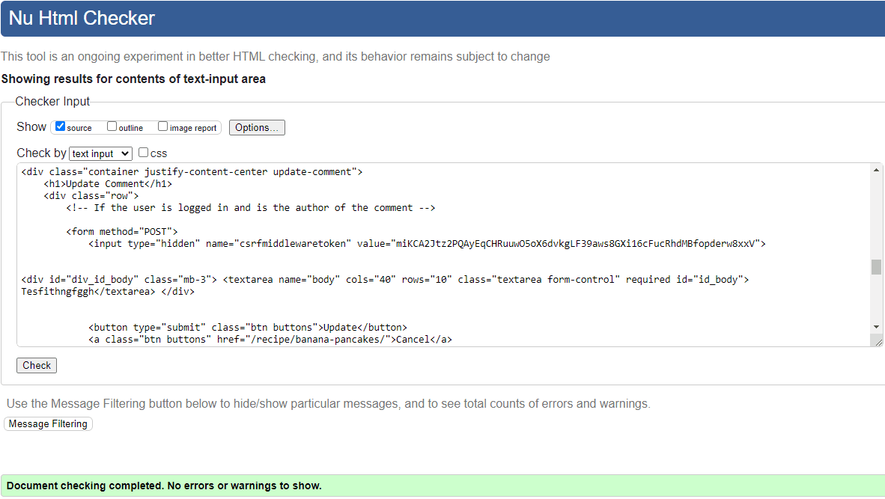

# Happy Beans - Testing

Return to [README](https://github.com/ShizukaDonaghue/happy-beans)

## Code Validation

### HTML
[W3C HTML Validator](https://validator.w3.org/) was used to validate HTML codes used in the application.
Each page was checked for any issues and syntax errors.
Initiallly, there were errors resulting from a missing closing tag and image height values.
Once these issues were rectified, all pages passed validation, except for the errors related to Summernote codes and Bootstrap property.
Please see below results for each page.

  
Home Page - No isses or errors

  
  

  
Sigup Page - No issues or errors

  
  

  
Login Page - No issues or errors

  
  

  
Logout Page - No issues or errors

  
  

  
Browse Recipes Page - No issues or errors

  
  

  
My Favourites Page - No issues or errors
 
  
  

  
My Recipes Page - No issues or errors
 
  
  

  
Update Comment Page - No issues or errors
 
  
  

  
403 Error Page - No issues or errors
 
  
  

  
404 Error Page - No issues or errors
 
  
  

  
Post Recipe Page - Errors identified for Summernote fields
 
  
  
  
  
  

The errors identified were all related to Summernote widget that is used in the recipe form. Since the errors resulted from Summernote codes, these were left untouched.
However, these errors do not affect the functionality of the application.

  
Update Recipe Page - Errors identified for Summernote fields
 
  
  
  
  
  

The errors identified were all related to Summernote widget that is used in the recipe form. Since the errors resulted from Summernote codes, these were left untouched.
However, these errors do not affect the functionality of the application.

  
Recipe Details Page - Errors identified for Bootstrap CSS Property
 
  
  
  

The errors identified were all related to Bootstrap CSS property. Since the errors resulted from Bootstrap codes, these were left untouched.

### CSS
[W3C CSS Validator](https://jigsaw.w3.org/css-validator/) was used to validate CSS codes used in the application and no issues or errors were found.

  
CSS Codes - No issues or errors
 
  
  

### JavaScript
[JSHint](https://jshint.com/) was used to validate JavaScript codes used in the application and no issues or errors were found.

  
JavaScript Codes - No issues or errors
 
  
  

### Python
[CI Python Linter](https://pep8ci.herokuapp.com/) was used to validate Python codes used throughout the application and no issues or errors were found.
Please see the results for each page.

#### Happy Beans Project

  
asgi.py - No issues or errors
 
  
  

  
settings.py - No issues or errors
 
  
  

Note: `# noqa` was added to Django generated codes under "AUTH_PASSWORD_VALIDATORS" and also to Cloudinary storage under "STATICFILES_STORAGE" to ignore "line too long" errors as these could not be shortened without breaking the codes.

  
urls.py - No issues or errors
 
  
  

  
wsgi.py - No issues or errors
 
  
  

#### Recipe App

  
admin.py - No issues or errors
 
  
  

  
apps.py - No issues or errors
 
  
  

  
filters.py - No issues or errors
 
  
  

  
forms.py - No issues or errors
 
  
  

  
models.py - No issues or errors
 
  
  

  
urls.py - No issues or errors
 
  
  

  
validators.py - No issues or errors
 
  
  

  
views.py - No issues or errors
 
  
  

  
recipeapp_tags.py - No issues or errors
 
  
  

## Accessibility
[Wave Web Accessibility Evaluation Tools](https://wave.webaim.org/) was used to test accessibility and no errors or contrast errors were found.

  
Home Page - No errors

  
  

  
Sigup Page - No errors

  
  

  
Login Page - No errors

  
  

  
Logout Page - No errors

  
  

  
Browse Recipes Page - No errors

  
  

  
My Favourites Page - No errors
 
  
  

  
My Recipes Page - No errors
 
  
  

  
Update Comment Page - Missing Form Label Error
 
  
  

The error identified was a missing form label for the Crispy Form used in the Comment field. Since the error resulted from the Crispy Form codes, this was left untouched.

  
403 Error Page - No errors
 
  
  

  
404 Error Page - No errors
 
  
  

  
Post Recipe Page - No errors
 
  
  

  
Update Recipe Page - Empty Link Error
 
  
  

The error identified was for an empty link for the current recipe image loaded. Since the error resulted from the Crispy Form codes, this was left untouched.

  
Recipe Details Page - Missing Form Label Error
 
  
  

The error identified was a missing form label for the Crispy Form used in the Comment field. Since the error resulted from the Crispy Form codes, this was left untouched.

