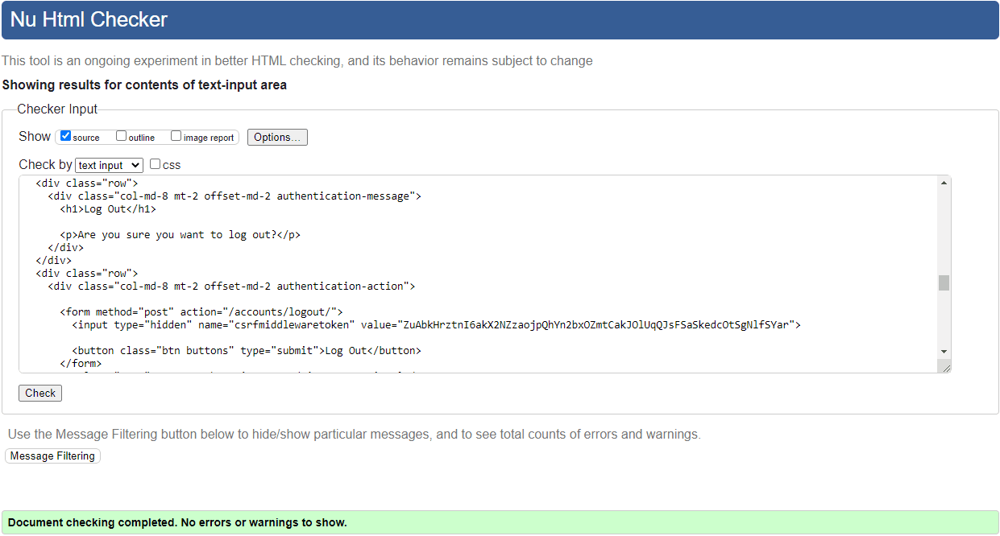
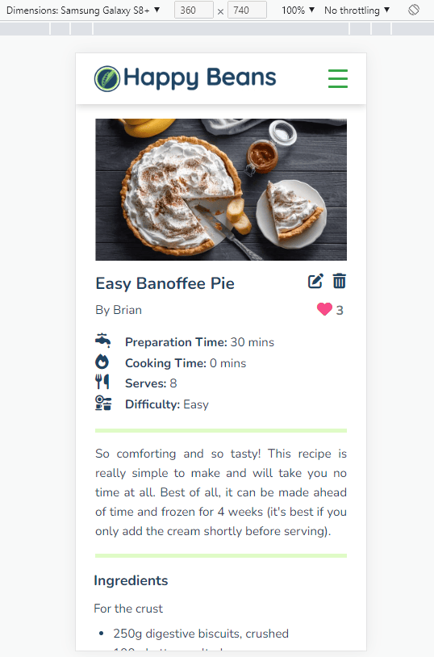
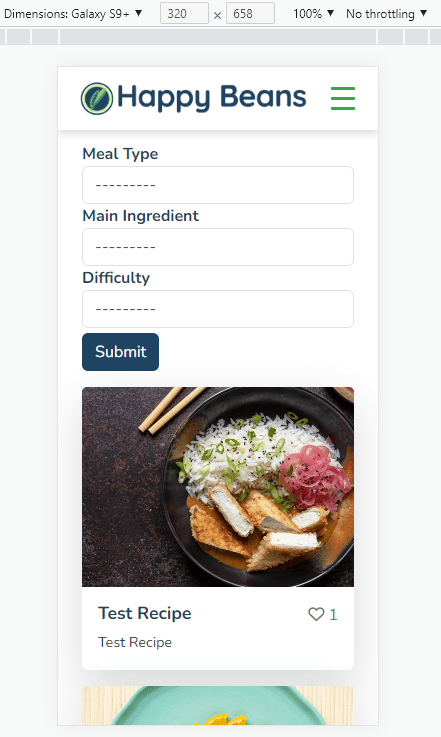
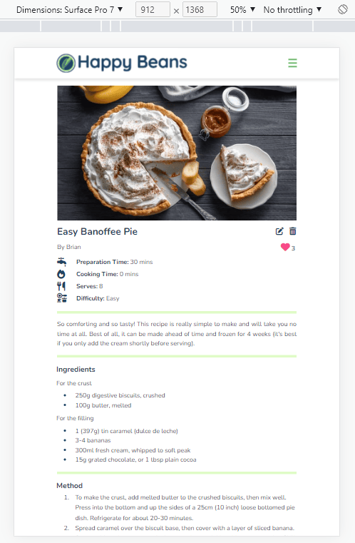
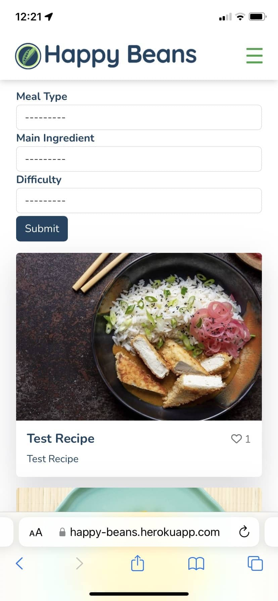
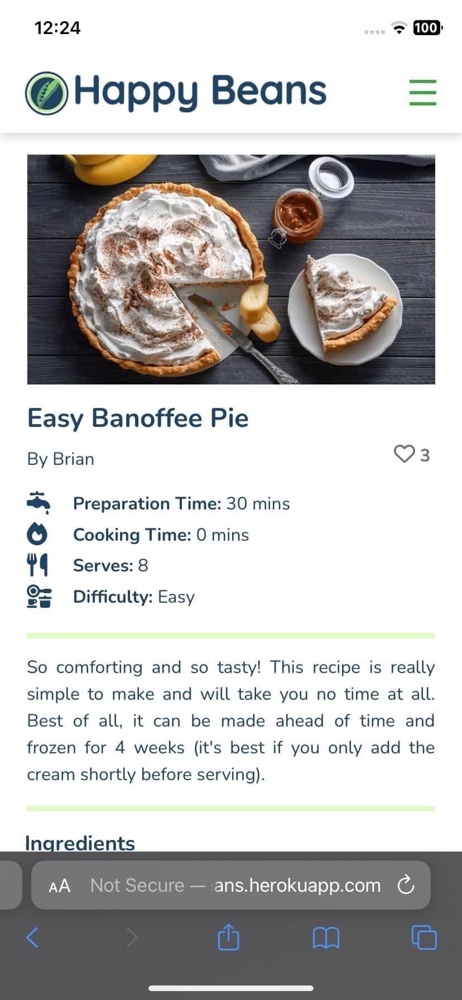
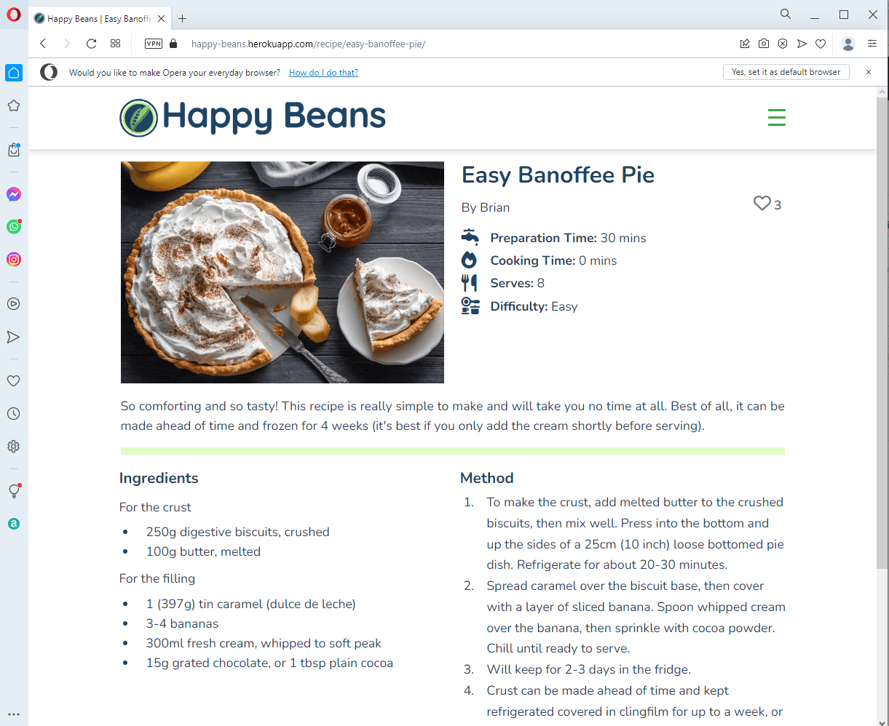
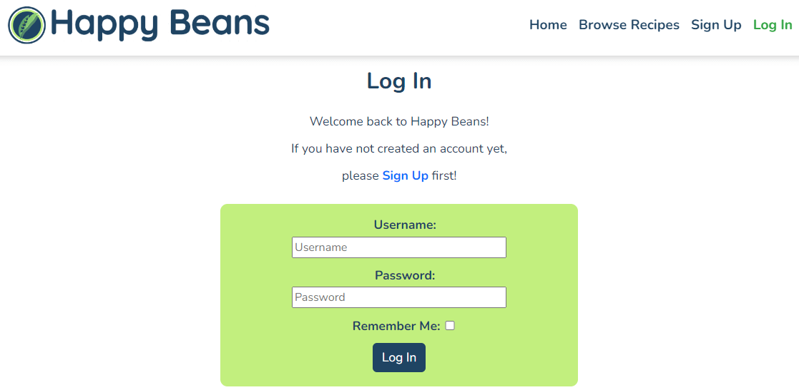
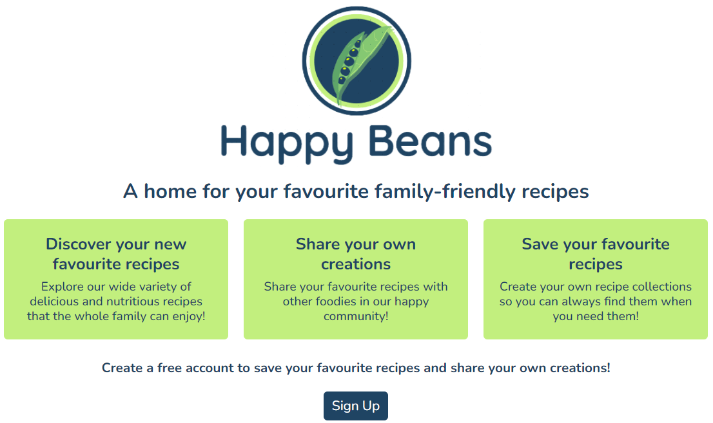

# Happy Beans - Testing

Return to [README](https://github.com/ShizukaDonaghue/happy-beans)

## Code Validation

### HTML
All HTML pages were validated using [W3C HTML Validator](https://validator.w3.org/) to check for any issues or syntax errors. The only errors identified were for Summernote fields.
Please see below results for each page.

  
Home Page - No isses or errors

  
  

  
Sigup Page - No issues or errors

  
  

  
Login Page - No issues or errors

  
  

  
Logout Page - No issues or errors

  
  

  
Browse Recipes Page - No issues or errors

  
  

  
My Favourites Page - No issues or errors
 
  
  

  
My Recipes Page - No issues or errors
 
  
  

  
Update Comment Page - No issues or errors
 
  
  

  
Post Recipe Page - Errors identified for Summernote fields
 
  
  
  
  
  

The errors identified were all related to Summernote widget that is used in the recipe form. Since the errors resulted from Summernote codes, these were not addressed. However, these errors do not affect the functionality of the application.

  
Update Recipe Page - Errors identified for Summernote fields
 
  
  
  
  
  

The errors identified were all related to Summernote widget that is used in the recipe form. Since the errors resulted from Summernote codes, these were not addressed. However, these errors do not affect the functionality of the application.

  
Recipe Details Page - Errors identified for Summernote fields
 
  
  
  

The errors identified were all related to CSS property used in Summernote list items for unordered list. Since the errors resulted from Summernote codes, these were not addressed.

  
403 Error Page - No issues or errors
 
  
  

  
404 Error Page - No issues or errors
 
  
  

### CSS
CSS codes used in the application were validated using [W3C CSS Validator](https://jigsaw.w3.org/css-validator/) and no issues or errors were found.

  
CSS Codes - No issues or errors
 
  
  

### JavaScript
JavaScript codes used in the application were validated using [JSHint](https://jshint.com/) and no issues or errors were found.

  
JavaScript Codes - No issues or errors
 
  
  

### Python
Python codes used throughout the application were validated using [CI Python Linter](https://pep8ci.herokuapp.com/) and no issues or errors were found.
Please see the results for each page.

#### Happy Beans Project

  
asgi.py - No issues or errors
 
  
  

  
settings.py - No issues or errors
 
  
  

Note: `# noqa` was added to Django generated codes under `AUTH_PASSWORD_VALIDATORS` and also to Cloudinary storage under `STATICFILES_STORAGE` for "line too long" errors to be ignored as these could not be shortened without breaking the codes.

  
urls.py - No issues or errors
 
  
  

  
wsgi.py - No issues or errors
 
  
  

#### Recipe App

  
admin.py - No issues or errors
 
  
  

  
apps.py - No issues or errors
 
  
  

  
filters.py - No issues or errors
 
  
  

  
forms.py - No issues or errors
 
  
  

  
models.py - No issues or errors
 
  
  

  
urls.py - No issues or errors
 
  
  

  
validators.py - No issues or errors
 
  
  

  
views.py - No issues or errors
 
  
  

  
recipeapp_tags.py - No issues or errors
 
  
  

## Accessibility
[Wave Web Accessibility Evaluation Tools](https://wave.webaim.org/) was used to test accessibility. The only errors identified were for Crispy Form fields. Please see below results for each page.

  
Home Page - No errors

  
  

  
Sigup Page - No errors

  
  

  
Login Page - No errors

  
  

  
Logout Page - No errors

  
  

  
Browse Recipes Page - No errors

  
  

  
My Favourites Page - No errors
 
  
  

  
My Recipes Page - No errors
 
  
  

  
Update Comment Page - Missing form label error
 
  
  

The error identified was a missing form label for the Crispy Form used in the Comment field. Since the error resulted from the Crispy Form codes, this was not addressed.

  
Post Recipe Page - No errors
 
  
  

  
Update Recipe Page - Empty link error
 
  
  

The error identified was for an empty link for the current recipe image loaded. Since the error resulted from the Crispy Form codes, this was not addressed.

  
Recipe Details Page - Missing form label error
 
  
  

The error identified was a missing form label for the Crispy Form used in the Comment field. Since the error resulted from the Crispy Form codes, this was not addressed.

  
403 Error Page - No errors
 
  
  

  
404 Error Page - No errors
 
  
  

## Lighthouse
XXXXXXXXXXXXXXXX  NEED SCREENSHOTS  XXXXXXXXXXXXXXXXXXXX

## Responsiveness
Responsiveness was tested using [Chrome Dev Tools](https://developer.chrome.com/docs/devtools/) and no issues were found.
This included the following devices:

  
iPhone 5/SE

  
  

  
iPhone 6/7/8

  
  

  
iPhone 6/7/8 Plus

  
  

  
iPhone SE

  
  

  
iPhone XR

  
  

  
iPhone 12 Pro

  
  

  
iPhone X

  
  

  
iPad Air

  
  

  
iPad Mini

  
  

  
Samsung Galaxy S8+

  
  

  
Samsung Galaxy S9+

  
  

  
Samsung Galaxy S20 Ultra

  
  

  
Samsung Galaxy A51/71

  
  

  
Microsoft Surface Pro 7

  
  

  
Microsoft Surface Duo

  
  

  
Nest Hub

  
  

  
Nest Hub Max

  
  

## Device Testing
The application was tested manually on the follwoing devices and no issues were found:

  
iPhone 12

  
  

  
iPhone 11

  
  

  
iPhone XR

  
  

  
iPhone 8

  
  

  
iPad 8

  
  

  
HP Elitebook 840

  
  

  
Dell XPS

  
  

## Browser Compatibility
Browser compatibility was checked for the following browsers and no issues were found:

  
Google Chrome

  
  

  
Microsoft Edge

  
  

  
Apple Safari

  
  

  
Mozilla Firefox

  
  

  
Opera

  
  

## User Stories Testing
User stories were tested and addressed as follows.

### **EPIC: User Account**
#### *As a Site User, I can register an account so that I can access all the application's features.*  
Sign Up button is available on the Home page as well as on the navigation bar for users who are not logged in already.   
  
Once the Sign Up link is clicked, users are directed to Sign Up page where they can register their details to log in and enable all the application's features.  
  

#### *As a Site User, I can log into my account so that all the application's features are available to me.*  
Log In link is available on the navigation bar for returning users who are not logged in already.   
  
Once they fill in their details, they are logged in to enable all the application's features.  

#### *As a Site User, I can log out of my account so that I can keep my account secure.*  
Log Out link is available on the navigation bar for registered users who are already logged in.   
  

### **EPIC: Site Admin**
#### *As a Site Admin, I can create, update and delete recipes and comments so that I can manage the contents of my app.*  
The Admin role has full CRUD functionality for all recipes and comments from the admin panel so that all the contents can be managed from there.  
  

### **EPIC: Site Navigation**
#### *As a Site User, I can understand the purpose of the app clearly so that I can decide whether the contents are right for me to sign up.*  
The landing page introduces the application explaining its purpose and benefits for signing up. This page also contains Sign Up button which directs users to Sign Up page.   
  

#### *As a Site User, I can navigate the site intuitively so that I can easily find what I am looking for.*  
A navigation bar is avaible on every page, which is fixed at the top of the screen for ease of use and fully responsive to all screen sizes. This allows users to navigate through the site easily. The link for the current page is shown in green to give a visual clue indicating which page they are in.   
  

#### *As a Site User, I can browse a paginated list of recipes so that I can easily select a recipe to view.*  
Browse Recipes page displays 12 recipe cards per page. Each card contains the recipe image, title, description and the number of likes. Users can easily browse through the recipes and select a recipe to view the full details by clicking anywhere on the card.   
  

#### *As a Site User, I can select a recipe from the list so that I can view the full details of a recipe.*  
Recipe cards are available in Browse Recipes, My Favourites and My Recipes pages. Once a recipe card is selected, users are directed to the Recipe Details page, which displays the full detalis of the recipe.  
  

#### *As a Site User, I can view the comments posted by others so that I can see the feedback and conversation for each recipe.*  
Comment section is available on Recipe Details page underneath the recipe, where comments are display in ascending order based on posting dates.  Users can views the feedback and conversation for each recipe here.  
  

#### *As a Site User, I can filter the recipes by meal type so that I can view a list of recipes for the meal type.*  
Recipe filters are available in Browse Recipes page where users can select a meal type to view the recipes based on the chosen criteria.  
  

#### *As a Site User, I can filter the recipes by main ingredient so that I can view a list of recipes using the main ingredient.*  
Recipe filters are available in Browse Recipes page where users can select a main ingredient to view the recipes based on the chosen criteria.  
  

#### *As a Site User, I can filter the recipes based on difficulty so that I can view a list of recipes suitable for my level.*  
Recipe filters are available in Browse Recipes page where users can select a difficulty level to view the recipes based on the chosen criteria.  
  

#### *As a Site User, I can see a custom error message when an HTTP error occurs so that I can understand why the error has occurred and easily navigate back to the website.*  
Custom pages for 400, 403, 404 and 500 erros have been created.   
Each error page contains a link to the Home page as well as Browse Recipes page so that users can easily navigate back to the website.  
  

### **EPIC: Recipe Management**
#### *As a Site User, I can post my own recipe so that I can share it with others.*  
For logged-in users, Post a Recipe link is available from the navigation bar, which directs them to Post Recipe page. Users can fill in the form to share the recipe with others in the community. The form is easy to understand and users can opt to use bullet points for ingredients and method to organise the contents.  
  

#### *As a Site User, I can draft a recipe and save it so that I can return later and edit it.*  
For logged-in users, Post a Recipe link is available from the navigation bar, which directs them to Post Recipe page. Users can fill in the form but decide not to published the recipe yet by selecting "Save as Draft" option in the form.  
  
Saved drafts are added to My Recipes page where they can return later and edit them. These drafts are marked with red [Draft] next to the title so that they can be easily identified.  
  

#### *As a Site User, I can edit the recipes that I posed so that I can make changes after it has been submitted.*  
Users can edit their own recipe from Recipe Details page. Edit button is available for the author of the recipe.   
  
Once the edit button is selected, users are directed to Update Recipe page. This is the same form as the Post Recipe form, but the original details are populated from the database. Users can easily update their recipes in this form and submit the changes.  
  

#### * As a Site User, I can delete recipes that I posted so that I can remove them from the site.*  
Users can delete their own recipe from Recipe Details page. Delete button is available for the author of the recipe.  
  
Once the delete button is selected, a modal will be displayed to confirm the deletion.   
  

#### *As a Site User, I can view a list of recipes that I have posted or drafted so that I can manage them.*  
For logged-in users, My Recipes link is available from the navigation bar, which directs them to My Recipes page. Users can manage their own recipes from here by clicking anywhere on the recipe card, which directs them to the Recipe Details page.  
  

#### *As a Site User, I can see error messages when submitting a recipe form so that I understand how the errors can be resolved.*  
If there are any errors in the Post Recipe form, error messages are displayed. This aims to assist users in filling in the form correctly by explaining each error.  
  
  

### **EPIC: Recipe Comment**  
#### *As a Site User, I can comment on a recipe so that I can share my feedback and be involved in the conversation.*  
For logged-in users, Comment Form is available beneath each recipe. Users can post their comment from here to leave feedback on the recipe or ask questions, or just communicate with others in the community.  
  

#### *As a Site User, I can edit the comment I posted so that I can make changes to my comments.*  
For the author of the comment, a vertical ellipsis is available next to the comment posting date. Users can select the edit button here, which directs them to Update Comment page where they can edit the comment.  
  

#### *As a Site User, I can delete the comment I posted so that I can remove it from the comments section.*  
For the author of the comment, a vertical ellipsis is available next to the comment posting date. Users can select the delete button here, which opens a modal to confim the deletion.   
  

### **EPIC: Recipe Likes**
#### *As a Site User, I can view the number of likes for each recipe so that I can see the feedback from others.*  
The number of likes for each recipe is displayed in the recipe card in Browse Recipes, My Favourites and My Recipe pages. It is also displayed in the Recipe Details page for each page.  
  
  

#### *As a Site User, I can view the list of my liked recipes so that I can easily go back to them within the site.*  
For logged-in users, My Recipe link is available from the navigation bar, which direct them to My Favourites page. Once a recipe is liked, the recipe is added to this page for the user so that they can easily find them when they need them.  
  

#### *As a Site User, I can like a recipe so that I can interact with the content.*  
For logged-in users, the like button is available on Recipe Details page if they have not yet liked the recipe. If the recipe is not yet liked, the love heart with a plus sign is displayed. The recipe can easily be liked by clicking on this icon.  
  

#### *As a Site User, I can unlike a recipe so that I can remove it from my liked recipes.*  
For logged-in users, the unlike button is available on Recipe Details page if they have already liked the recipe. If the recipe is already liked, the love heard icon is displayed. The recipe can easily be unliked by clicking on this icon.  
  

## Features Testing
Manual testing was performed using Google Chrome to verify that all the features functioned as expected and no issues were found.

### Browser Tab
Feature | Action | Expected Result | PASS/FAIL
---|---|---|---
Favicon | Display | Favicon is displayed correctly in the browser tab | PASS
Title | Display | "Home" is displayed as the title of the page for Home page | PASS
Title | Display | "Browse Recipes" is displayed as the title of the page for Browse Recipes page | PASS
Title | Display | The title of the recipe is displayed as the title of the page for each Recipe Details page | PASS
Title | Display | "My Favourites" is displayed as the title of the page for My Favourites page | PASS
Title | Display | "My Recipes" is displayed as the title of the page for My Recipes page | PASS
Title | Display | "Post Recipe" is displayed as the title of the page for Post Recipe page | PASS
Title | Display | "Update Recipe" is displayed as the title of the page for Update Recipe page | PASS
Title | Display | "Update Comment" is displayed as the title of the page for Update Comment page | PASS
Title | Display | "Signup" is displayed as the title of the page for Signup page | PASS
Title | Display | "Login" is displayed as the title of the page for Login page | PASS
Title | Display | "Logout" is displayed as the title of the page for Logout page | PASS

### Navigation Bar
Feature | Action | Expected Result | PASS/FAIL
---|---|---|---
Menu | Display | Links displayed side by side in the navigation bar for screen sizes with a minimum width of 1200px | PASS
Position | Display | Navigation bar always stays at the top of the screen | PASS
Logo | Click | Navigates to Home page | PASS
Home Link | Click | Navigates to Home page | PASS
Browse Recipes Link | Click |Navigates to Browse Recipes page | PASS
Sign Up Link | Display | Only available if the user is not logged in | PASS
Sign Up Link | Click | Navigates to Sign Up page | PASS
Log In Link | Display | Only available if the user is not logged in | PASS
Log In Link | Click | Navigates to Log In page | PASS
Log Out Link | Display | Only available if the user is logged in | PASS
Log Out Link | Click | Navigates to Log Out page | PASS
My Favourites Link | Display | Only available if the user is logged in | PASS
My Favourites Link | Click| Navigates to My Favourites page | PASS
My Recipes Link | Display | Only available if the user is logged in | PASS
My Recipes Link | Click| Navigates to My Recipes page | PASS
Post a Recipe Link | Display | Only available if the user is logged in | PASS
Post a Recipe Link | Click| Navigates to Post a Recipe page to | PASS
All Links | Hover | Colour changes to green with hover effect | PASS
All Links | Display | Active page is shown in green | PASS

### Hamburger Menu
Feature | Action | Expected Result | PASS/FAIL
---|---|---|---
Menu | Display | Hamburger menu displayed in the navigation bar for screen sizes less than 1200px in width | PASS
Animation | Click | Animation functions correctly - X is displayed while the menu is open | PASS
Menu Closure | Click | Hamburger menu closes when clicked outside the menu | PASS
Menu Closure | Click | Hamburger menu closes when clicked on X | PASS 
Logo | Click | Navigates to Home page | PASS
Home Link | Click | Navigates to Home page | PASS
Browse Recipes Link | Click | Navigates to Browse Recipes page | PASS
Sign Up Link | Display | Only available if the user is not logged in | PASS
Sign Up Link | Click | Navigates to Sign Up page | PASS
Log In Link | Display | Only available if the user is not logged in | PASS
Log In Link | Click | Navigates to Log In page | PASS
Log Out Link | Display | Only available if the user is logged in | PASS
Log Out Link | Click | Navigates to Log Out page | PASS
My Favourites Link | Display | Only available if the user is logged in | PASS
My Favourites Link | Click| Navigates to My Favourites page | PASS
My Recipes Link | Display | Only available if the user is logged in | PASS
My Recipes Link | Click| Navigates to My Recipes page | PASS
Post a Recipe Link | Display | Only available if the user is logged in | PASS
Post a Recipe Link | Click| Navigates to Post a Recipe page to | PASS
All Links | Hover | Colour changes to green with hover effect | PASS
All Links | Display | Active page is shown in green | PASS

### Footer
Feature | Action | Expected Result | PASS/FAIL
---|---|---|---
Position | Display | Footer always stays at the bottom of the screen even when the content does not occupy the full view height | PASS
Facebook Link | Click | Opens Facebook in a new tab | PASS
Twitter Link | Click | Opens Twitter in a new tab | PASS
Instagram Link | Click | Opens Instagram in a new tab | PASS
GitHub Link | Click | Opens GitHub in a new tab | PASS
LinkedIn Link | Click | Opens LinkedIn in a new tab | PASS
All Links | Hover | Colour changes to green with hover effect | PASS

### Signup Page
Feature | Action | Expected Result | PASS/FAIL
---|---|---|---
Username Field | Leave Empty | Form does not submit | PASS
Username Field | Leave Empty | Error message is displayed | PASS
Username Field | Duplicate Username | Form does not submit | PASS
Username Field | Duplicate Username | Error message is displayed | PASS
Email Field | Leave Empty | Form submits without email address as this is an optional field | PASS
Email Field | Enter Invalid Format | Form does not submit | PASS
Email Field | Enter Invalid Format | Error message is displayed | PASS
Email Field | Duplicate Email Address | Form does not submit | PASS
Email Field | Duplicate Email Address | Error message is displayed | PASS
Password Field | Leave Empty | Form does not submit | PASS
Password Field | Leave Empty | Error message is displayed | PASS
Password Field | Passwords Not Matched | Form does not submit | PASS
Password Field | Passwords Not Matched | Error message is displayed | PASS
Log In Link | Click | Navigates to Log In page | PASS
Sign Up Link | Click | Once all the required fields are correctly filled in, creates an account | PASS
Sign Up Link | Click | Once an account is created, logs in the user | PASS
Sign Up Link | Click | Once the user is logged in, navigates to Home page | PASS
Alert | Submit | Success message is displayed confirming the user has logged in as [username] | PASS
Alert | Submit | Success message is removed after 3 seconds | PASS

### Login Page
Feature | Action | Expected Result | PASS/FAIL
---|---|---|---
Username Field | Leave Empty | Form does not submit | PASS
Username Field | Leave Empty | Error message is displayed | PASS
Password Field | Leave Empty | Form does not submit | PASS
Password Field | Leave Empty | Error message is displayed | PASS
Login Fields | Incorrect Details | Form does not submit | PASS
Login Fields | Incorrect Details | Error message is displayed | PASS
Sign Up Link | Click | Navigates to Sign Up page | PASS
Log In Link | Click | Once the required fields are correctly filled in, logs in the user | PASS
Log In Link | Click | Once the user is logged in, navigates to Home page | PASS
Alert | Submit | Success message is displayed confirming the user has logged in as [username] | PASS
Alert | Submit | Success message is removed after 3 seconds | PASS

### Logout Page
Feature | Action | Expected Result | PASS/FAIL
---|---|---|---
Log Out Link | Click | Logs out the user | PASS
Log Out Link | Click | Once the user is logged out, navigates to Home page | PASS
Browse Recipes Link | Click | Navigates to Browse Recipes page | PASS
Alert | Submit | Success message is displayed confirming that the user has logged out | PASS
Alert | Submit | Success message is removed after 3 seconds | PASS

### Home Page
Feature | Action | Expected Result | PASS/FAIL
---|---|---|---
Sign Up Message | Display | Correct message is displayed if the user is not logged in | PASS
Sign Up Link | Display | Only available if the user is not logged in | PASS
Sign Up Link | Click | Navigates to Sign Up page | PASS
Post a Recipe Message | Display | Correct message is displayed if the user is logged in | PASS
Post a Recipe Link | Display | Only available if the user is logged in | PASS
Post a Recipe Link | Click| Navigates to Post a Recipe page | PASS

### Browse Recipes Page
#### Recipe Filters
Feature | Action | Expected Result | PASS/FAIL
---|---|---|---
Filter Dropdown Menu | Display | Dropdown menu is displayed correctly for each filter | PASS
Filter Functionality | Click | Filters recipes based on the criteria selected | PASS
Filter Functionality | Click | Clears filters when no criteria is selected | PASS
Filter Functionality | Display | When there are no recipes to display, Browse Recipes button and correct message are displayed | PASS
Browse Recipes Link | Click | Navigates back to Browse Recipes page without any filter criteria applied | PASS
Pagination | Display | When there are more than 12 recipes to display, the filtered list of recipes is paginated correctly and maintains the filter criteria when navigating through the pages (previous, next, first and last pages) | PASS
Pagination | Display | When there are less than 12 recipes to display, pagination is not displayed | PASS

#### Recipe Cards
Feature | Action | Expected Result | PASS/FAIL
---|---|---|---
Recipe Card | Display | Recipes published are displayed in descending order basd on creation dates| PASS
Recipe Card | Display | Draft recipes are not displayed | PASS
Recipe Card | Click | Stretched link is applied correctly and clicking anywhere on a card navigtes to the correct Recipe Details page | PASS
Recipe Card | Hover | Box shadow is applied with hover effect | PASS
Recipe Card Height | Display | Recipe cards are displayed in the same height for each row regardless of the height of card body content (when the height of a card is higher, the rest of the cards in the same row are stretched to the same height) | PASS  
Recipe Card Width | Display | Recipe cards are displayed in the same width for each column and column width is the same for all columns displayed | PASS
Recipe Image | Display | When a recipe image is uploaded, the image is displayed correctly from Cloudinary | PASS
Recipe Image | Display | When a recipe image is not uploaded, the placeholder image is displayed correctly from Cloudinary | PASS
Image Size | Display | Images are displayed in the same height and width regardless of the size or aspect ratio of the images uploaded | PASS
Recipe Title | Display | First letter is always capitalised regardless of whether the title entered is capitalised | PASS
Number of Likes | Display | The number of likes is displayed correcty with a grey love heart and the nubmer indicating the number of likes | PASS
Recipe Description | Display | First letter is always capitalised regardless of whether the description entered is capitalised | PASS
Recipe Description | Display | Description is truncated to 70 characters for display on the recipe cards | PASS  
Pagination | Display | When there are more than 12 recipes to display, pagination is added and functions correctly | PASS
Pagination | Display | When there are less than 12 recipes to display, pagination is not displayed | PASS

### Recipe Details Page
Feature | Action | Expected Result | PASS/FAIL
---|---|---|---
Recipe Image | Display | When a recipe image is uploaded, the image is displayed correctly from Cloudinary | PASS
Recipe Image | Display | When a recipe image is not uploaded, the placeholder image is displayed correctly from Cloudinary | PASS
Image Size | Display | For screen sizes with a minimum width of 992px, the image height is set to occupy the maximum height of recipe summary container next to the image | PASS
Recipe Title | Display | First letter is always capitalised regardless of whether the title entered is capitalised | PASS
Edit/Delete Recipe Button | Display | Edit/Delete button is available if the user is logged in and is the author of the recipe | PASS
Edit Recipe Button | Click | Opens Update Recipe page with the original details populated from the database | PASS
Edit Recipe Cancel Button | Click | Navigates back to Recipe Detail page | PASS
Delete Recipe Button | Click | Displays the modal asking the user to confirm deletion | PASS
Like/Unlike Button | Display | Like/Unlike button is available if the user is logged in and the recipe is published | PASS
Like/Unlike Button | Display | Like/Unlike button is greyed out and not clickable if the user is not logged in or the recipe is not yet published | PASS
Like/Unlike Button | Click | Toggles between Like (a love heart & plus icon) and Unlike (a love heart icon) if the user is logged in and the recipe is published | PASS
Number of Likes | Display | The number of likes is dispalyed and increases or decreases correctly when the reipe is liked or unliked | PASS
Recipe Description | Display | First letter is always capitalised regardless of whether the description entered is capitalised | PASS
Ingredients | Display | Details are displayed correctly from Summernote field in the default font and font size | PASS
Method | Display | Details are displayed correctly from Summernote field in the default font and font size | PASS
Comments | Display | If there are no comments, correct message is displayed | PASS
Comments | Display | Displays comments, authors and dates in ascending order if there are comments | PASS
Post Comment | Display | If the user is not logged in, correct message is displayed | PASS
Post Comment | Display | If the recipe is not published, correct message is displayed | PASS
Post Comment | Display | Comment form is only available if the user is logged in and the recipe is published | PASS
Post Comment | Display | First letter is always capitalised regardless of whether the comment entered is capitalised | PASS
Post Comment | Leave Empty | Form does not submit | PASS
Post Comment | Submit | Form submits and comment is added in ascending order based on posting dates | PASS
Alert | Submit | Success message is displayed confirming the comment has been added successfully | PASS
Alert | Submit | Success message is removed after 3 seconds | PASS
Edit/Delete Comment Dropdown Menu | Display | Edit/Delete button is available if the user is logged in and is the author of the comment | PASS
Edit Comment Button | Click | Opens Update Comment page with the original details populated from the database | PASS
Delete Comment Button | Click | Displays the modal asking the user to confirm deletion | PASS

### My Favourites Page
Feature | Action | Expected Result | PASS/FAIL
---|---|---|---
Defensive Measure | Not Logged-in and Try to Acess the Page by Changing URL | Navigates the user to Log In page | PASS
Recipe Card | Display | Recipes liked by the user are displayed in descending order based on creation dates | PASS
Recipe Card | Click | Stretched link is applied correctly and clicking anywhere on a card navigtes to the correct Recipe Details page | PASS
Recipe Card | Hover | Box shadow is applied with hover effect | PASS
Recipe Card Height | Display | Recipe cards are displayed in the same height for each row regardless of the height of card body (when the height of a card is higher, the rest of the cards in the same row are stretched to the same height) | PASS  
Recipe Card Width | Display | Recipe cards are displayed in the same width for each column and column width is the same for all columns displayed | PASS
Recipe Card | Display | When there are no recipes to display, Browse Recipes button and correct message are displayed | PASS
Browse Recipes Link | Click | Navigates to Browse Recipes page | PASS
Recipe Image | Display | When a recipe image is uploaded, the image is displayed correctly from Cloudinary | PASS
Recipe Image | Display | When a recipe image is not uploaded, the placeholder image is displayed correctly from Cloudinary | PASS
Image Size | Display | Images are displayed in the same height and width regardless of the size or aspect ratio of the images uploaded | PASS
Recipe Title | Display | First letter is always capitalised regardless of whether the title entered is capitalised | PASS
Number of Likes | Display | The number of likes is displayed correcty with a grey love heart and the nubmer indicating the number of likes | PASS
Recipe Description | Display | First letter is always capitalised regardless of whether the description entered is capitalised | PASS
Recipe Description | Display | Description is truncated to 70 characters for display on the recipe cards | PASS  
Pagination | Display | When there are more than 12 recipes to display, pagination is added and functions correctly | PASS
Pagination | Display | When there are less than 12 recipes to display, pagination is not displayed | PASS

### My Recipes Page
Feature | Action | Expected Result | PASS/FAIL
---|---|---|---
Defensive Measure | Not Logged-in and Try to Acess the Page by Changing URL | Navigates the user to Log In page | PASS
Recipe Card | Display | Recipes posted by the user are displayed in descending order based on creation dates | PASS
Recipe Card | Click | Stretched link is applied correctly and clicking anywhere on a card navigtes to the correct Recipe Details page | PASS
Recipe Card | Hover | Box shadow is applied with hover effect | PASS
Recipe Card Height | Display | Recipe cards are displayed in the same height for each row regardless of the height of card body content (when the height of a card is higher, the rest of the cards in the same row are stretched to the same height) | PASS  
Recipe Card Width | Display | Recipe cards are displayed in the same width for each column and column width is the same for all columns displayed | PASS
Recipe Card | Display | [Draft] in red font is added to the recipe title if the recipe is not published | PASS
Recipe Card | Display | When there are no recipes to display, Post a Recipe button, Browse Recipes button and correct messages are displayed | PASS
Post a Recipe Link | Click | Navigates to Post Recipe page | PASS
Browse Recipes Link | Click | Navigates to Browse Recipes page | PASS
Recipe Image | Display | When a recipe image is uploaded, the image is displayed correctly from Cloudinary | PASS
Recipe Image | Display | When a recipe image is not uploaded, the placeholder image is displayed correctly from Cloudinary | PASS
Image Size | Display | Images are displayed in the same height and width regardless of the size or aspect ratio of the images uploaded | PASS
Recipe Title | Display | First letter is always capitalised regardless of whether the title entered is capitalised | PASS
Number of Likes | Display | The number of likes is displayed correcty with a grey love heart and the nubmer indicating the number of likes | PASS
Recipe Description | Display | First letter is always capitalised regardless of whether the description entered is capitalised | PASS
Recipe Description | Display | Description is truncated to 70 characters for display on the recipe cards | PASS  
Pagination | Display | When there are more than 12 recipes to display, pagination is added and functions correctly | PASS
Pagination | Display | When there are less than 12 recipes to display, pagination is not displayed | PASS

### Post Recipe Page
Feature | Action | Expected Result | PASS/FAIL
---|---|---|---
Defensive Measure | Not Logged-in and Try to Acess the Page by Changing URL | Navigates the user to Log In page | PASS
Title | Leave Empty | Form does not submit | PASS
Title | Leave Empty | Error message is displayed | PASS
Title | Enter an Empty String | Form does not submit | PASS
Title | Enter an Empty String | Error message is displayed | PASS
Description | Leave Empty | Form does not submit | PASS
Description | Leave Empty | Error message is displayed | PASS
Description | Enter an Empty String | Form does not submit | PASS
Description | Enter an Empty String | Error message is displayed | PASS
Meal Type | Leave Empty | Form does not submit | PASS
Meal Type | Leave Empty | Error message is displayed | PASS
Main Ingredient | Leave Empty | Form does not submit | PASS
Main Ingredient | Leave Empty | Error message is displayed | PASS
Diet Type | Not Selected | Form submits as this is not a required field | PASS
Difficulty | Leave Empty | Form does not submit | PASS
Difficulty | Leave Empty | Error message is displayed | PASS
Preparation Time | Leave Empty | Form does not submit | PASS
Preparation Time | Leave Empty | Error message is displayed | PASS
Preparation Time | Enter Anything Other Than a Positive Integer | Form does not submit | PASS
Preparation Time | Enter Anything Other Than a Positive Integer | Error message is displayed | PASS
Cooking Time | Leave Empty | Form does not submit | PASS
Cooking Time | Leave Empty | Error message is displayed | PASS
Cooking Time | Enter Anything Other Than a Positive Integer | Form does not submit | PASS
Cooking Time | Enter Anything Other Than a Positive Integer | Error message is displayed | PASS
Serves | Leave Empty | Form does not submit | PASS
Serves | Leave Empty | Error message is displayed | PASS
Serves | Enter Anything Other Than a Positive Integer | Form does not submit | PASS
Serves | Enter Anything Other Than a Positive Integer | Error message is displayed | PASS
Ingredients | Leave Empty | Form does not submit | PASS
Ingredients | Leave Empty | Error message is displayed | PASS
Ingredients | Enter an Empty String | Form does not submit | PASS
Ingredients | Enter an Empty String | Error message is displayed | PASS
Method | Leave Empty | Form does not submit | PASS
Method | Leave Empty | Error message is displayed | PASS
Method | Enter an Empty String | Form does not submit | PASS
Method | Enter an Empty String | Error message is displayed | PASS
Image | Not Uploaded | Form submits as this is not a required field | PASS
Image | Click to Upload | Opens a file explorer to choose an image from | PASS
Image | Click to Upload | Chosen image file is displayed in 'Choose File' field | PASS
Status | Save as Draft | Once all the required fields are filled in correctly, saves the recipe | PASS
Status | Save as Draft | Once the recipe is saved as Draft, the recipe is displayed in My Recipe page | PASS
Status | Publish Now | Once all the required fields are filled in correctly, saves the recipe | PASS
Status | Publish Now  | Once the recipe is saved, the recipe is displayed in Browse Recipes page | PASS
Post Recipe | Submit | Displays the Recipe Details page which has been generated | PASS
Alert | Submit | Success message is displayed confirming [recipe title] has been added successfully | PASS
Alert | Submit | Success message is removed after 3 seconds | PASS
Post Recipe Cancel Button | Click | Navigates back to Browse Recipes page | PASS

### Update Recipe Page
Feature | Action | Expected Result | PASS/FAIL
---|---|---|---
Defensive Measure | Not Logged-in and Try to Access the Page by Changing URL | Navigates the user to Log In page | PASS
Defensive Measure | Logged-in and Try to Access Another User's Recipe by Changing URL | 403 error page is displayed | PASS
Update Recipe | Display | Update Recipe form contains the original details from database | PASS
Title | Leave Empty | Form does not submit | PASS
Title | Leave Empty | Error message is displayed | PASS
Title | Enter an Empty String | Form does not submit | PASS
Title | Enter an Empty String | Error message is displayed | PASS
Description | Leave Empty | Form does not submit | PASS
Description | Leave Empty | Error message is displayed | PASS
Description | Enter an Empty String | Form does not submit | PASS
Description | Enter an Empty String | Error message is displayed | PASS
Meal Type | Leave Empty | Form does not submit | PASS
Meal Type | Leave Empty | Error message is displayed | PASS
Main Ingredient | Leave Empty | Form does not submit | PASS
Main Ingredient | Leave Empty | Error message is displayed | PASS
Diet Type | Not Selected | Form submits as this is not a required field | PASS
Difficulty | Leave Empty | Form does not submit | PASS
Difficulty | Leave Empty | Error message is displayed | PASS
Preparation Time | Leave Empty | Form does not submit | PASS
Preparation Time | Leave Empty | Error message is displayed | PASS
Preparation Time | Enter Anything Other Than a Positive Integer | Form does not submit | PASS
Preparation Time | Enter Anything Other Than a Positive Integer | Error message is displayed | PASS
Cooking Time | Leave Empty | Form does not submit | PASS
Cooking Time | Leave Empty | Error message is displayed | PASS
Cooking Time | Enter Anything Other Than a Positive Integer | Form does not submit | PASS
Cooking Time | Enter Anything Other Than a Positive Integer | Error message is displayed | PASS
Serves | Leave Empty | Form does not submit | PASS
Serves | Leave Empty | Error message is displayed | PASS
Serves | Enter Anything Other Than a Positive Integer | Form does not submit | PASS
Serves | Enter Anything Other Than a Positive Integer | Error message is displayed | PASS
Ingredients | Leave Empty | Form does not submit | PASS
Ingredients | Leave Empty | Error message is displayed | PASS
Ingredients | Enter an Empty String | Form does not submit | PASS
Ingredients | Enter an Empty String | Error message is displayed | PASS
Method | Leave Empty | Form does not submit | PASS
Method | Leave Empty | Error message is displayed | PASS
Method | Enter an Empty String | Form does not submit | PASS
Method | Enter an Empty String | Error message is displayed | PASS
Image | Not Uploaded | Form submits as this is not a required field | PASS
Image | Click to Upload | Opens a file explorer to choose an image from | PASS
Image | Click to Upload | Chosen image file is displayed in 'Choose File' field | PASS
Status | Save as Draft | Once all the required fields are filled in correctly, saves the recipe | PASS
Status | Save as Draft | Once the recipe is saved as Draft, the recipe is displayed in My Recipe page | PASS
Status | Publish Now | Once all the required fields are filled in correctly, saves the recipe | PASS
Status | Publish Now  | Once the recipe is saved, the recipe is displayed in Browse Recipes page | PASS
Update Recipe | Submit | Displays the Recipe Details page which has been updated | PASS
Alert | Submit | Success message is displayed confirming the [recipe title] has been updated successfully | PASS
Alert | Submit | Success message is removed after 3 seconds | PASS
Update Recipe Cancel Button | Navigates back to Recipe Detail page | PASS

### Delete Recipe Modal
Feature | Action | Expected Result | PASS/FAIL
---|---|---|---
Delete Recipe | Submit | Once the user confirms deletion in the modal, the recipe is deleted | PASS
Alert | Submit | Success message is displayed confirming that the recipe has been deleted | PASS
Alert | Submit | Success message is removed after 3 seconds | PASS
Delete Recipe Cancel Button | Click | Modal is closed | PASS
Modal Closure | Click Outside Menu | Modal is closed | PASS

### Update Comment Page
Feature | Action | Expected Result | PASS/FAIL
---|---|---|---
Defensive Measure | Not Logged-in and Try to Access the Page by Changing URL | Navigates the user to Log In page | PASS
Defensive Measure | Logged-in and Try to Access Another User's Comment by Changing URL | 403 error page is displayed | PASS
Update Comment| Display | Update Comment form contains the original details from database | PASS
Comment Field | Leave Empty | Form does not submit | PASS
Comment Field | Leave Empty | Error message is displayed | PASS
Update Comment | Click | Comment is updated | PASS
Alert | Submit | Success message is displayed confirming the comment has been updated successfully | PASS
Alert | Submit | Success message is removed after 3 seconds | PASS
Update Comment Cancel Button | Click | Navigates back to Recipe Detail page | PASS

### Delete Comment Modal
Feature | Action | Expected Result | PASS/FAIL
---|---|---|---
Delete Comment| Submit | Once the user confirms deletion in the modal, the comment is deleted | PASS
Alert | Submit | Success message is displayed confirming that the comment has been deleted | PASS
Alert | Submit | Success message is removed after 3 seconds | PASS
Delete Comment Cancel Button | Click | Modal is closed | PASS
Modal Closure | Click Outside Menu | Modal is closed | PASS 

### 403 Error Page
Feature | Action | Expected Result | PASS/FAIL
---|---|---|---
Custom 403 Error Page  | Change URL to Acess Another User's Recipe | Custom 403 error message is displayed | PASS
Custom 403 Error Page | Change URL to Acess Another User's Comment | Custom 403 error message is displayed | PASS
Home Link | Click | Navigates to Home page | PASS
Browse Recipes Link | Click | Navigates to Home page | PASS

### 404 Error Page
Feature | Action | Expected Result | PASS/FAIL
---|---|---|---
Custom 404 Error Page | Enter URL that does not exist | Custom 404 error message is displayed | PASS
Home Link | Click | Navigates to Home page | PASS
Browse Recipes Link | Click | Navigates to Home page | PASS

## Bugs
### Resolved Bugs

* **Pagination for a Filtered List of Recipes**  

  ***Issue:***  
When [Django filters](https://django-filter.readthedocs.io/en/stable/) were added to Browse Recipes page, the standard [Django pagination](https://docs.djangoproject.com/en/3.2/topics/pagination/) no longer worked.
With the standard Django pagination, the filter criteria were no longer applied when navigating to another page and showed recipes that did not fall under the selected criteria.  

  ***Solution:***  
While searching for a solution, I learnt that this is a common issue with Django filters. 
Having reviewed many possible solutions to the issue, I decided to implement the soluction found in [Django Filter and Pagination](https://www.youtube.com/watch?v=dkJ3uqkdCcY) tutorial.
This solution uses [QueryString Template Tags](https://simpleisbetterthancomplex.com/snippet/2016/08/22/dealing-with-querystring-parameters.html) and works with Django filters.
RecipeList view codes and pagination codes for Browse Recipes page were updated to incorporate this solution for the Django filters.  

  Please click on the image to watch the GIF as auto looping is turned off to minimise distraction.  
  *Note: These recipes were created with filter categories in their titles to demonstrate the functionality of the filters.
  

* **Positioning of Remember Me Box**  

  ***Issue:***  
  The "Remember Me" box in Log In page was initially horizontally centralised with the rest of the contents.
  During the manual testing on iPhone 11, it was noted that the box was positioned to the left, although this was not the case in Chrome Developer.
  It appered the issue resulted from how Apple Safari rendered the codes.   
      
    
    ***Solution:***  
    CSS codes were added to target the "Remember Me" box and moved it to the right of the "Remember Me" text.
    The text and the box are now centralised together. 
    I felt that this was a more appropriate position for the box.  
    

### Unresolved Bugs

* **Integrity Error for Slug Key Value Violation**   

  ***Issue:***  
During the manual testing, when a recipe titled "Bob" was submitted in the deployed site, server error 500 occured.
The error in the development environment showed that it was caused by the duplicate key value as there was already a slug value "Bob" existed in the database and the slug key value must be unique.    
In the admin panel, it was verified that there was indeed a recipe titled "Bob" saved as a draft by a user.
When the draft recipe was deleted from the database, the error no longer occurred.  

  ***Status:***  
Post Recipe form prevents a recipe entry with the same title as an existing recipe and raises an error     
Attempts were made to recreate the error to investigate the issue further, however, I was never able to recreate the error.
Since the error could not be recreated, this bug was not addressed.  

There are no other known bugs.
